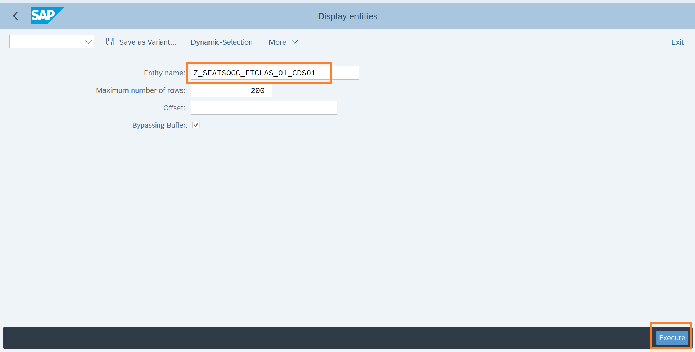
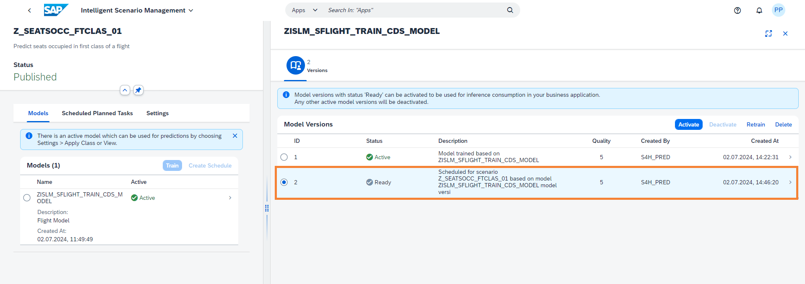

# Creating Custom AI Use Cases in SAP S/4HANA
## Context 

In the rapidly evolving landscape of AI and machine learning, **Intelligent Scenario Lifecycle Management (ISLM)** has emerged as a critical framework that bridges the gap between data science endeavors and practical application development. ISLM plays a pivotal role in streamlining and optimizing the adoption of AI solutions, particularly within the SAP S/4HANA environment. 

ISLM standardizes the integration and consumption of intelligent scenarios within SAP S/4HANA for both **Embedded** as well as **Side-by-Side** scenarios. 

ISLM can be leveraged to perform lifecycle operations, including (scheduled) (re-)training and deployment as well as activation of the model that should be consumed by the business application, directly within SAP S/4HANA. MLOps in ISLM is supported in the context of ML use case (Intelligent Scenario). 
 

## ISLM brief introduction
ISLM framework stacked into SAP S/4HANA, is the right tool for application developers for SAP S/4HANA. ISLM standardizes the integration and consumption of intelligent scenarios within SAP S/4HANA for both embedded as well as side-by-side scenarios. Thus, application developers are required to use ISLM to create, register, and publish new scenarios and to implement the consumption of that scenario within the business application.  

ISLM can be leveraged to perform lifecycle operations, including (scheduled) (re-)training and deployment as well as activation of the model that should be consumed by the business application, directly within SAP S/4HANA. ML ops in ISLM is supported in the context of ML use case (Intelligent Scenario).  

An application developer for SAP S/4HANA from SAP or customer/partner side, is mainly responsible for integrating the AI scenarios into the respective application. ISLM facilitates embedding AI into business application with a low code approach. 

By the end of this workshop, participants will gain a comprehensive understanding of how ISLM empowers organizations to smoothly transition from data science experimentation to real-world AI application development, all within the SAP S/4HANA environment. 

- **Business User:** The end user who interacts with the business application and uses the predictions from machine learning for the business purpose.
- **Business Administrator:** A domain expert or analytics specialist, who can perform model trainings based on business context, evaluate model quality, and can activate a model for production usage.
- **Technical Administrator:** A system administrator who can perform the configurations of connectivity between different entities as well as maintains the technical configurations of the system. 
- **ABAP Developer:** A developer who can create ABAP artifacts required for Intelligent Scenario registration.
- **Intelligent Scenario Owner:** A owner who creates, reviews and publishes Intelligent Scenario.

# [Exercise for Hands-on] Scenario storyline: Predict the number of first class seats occupied in a flight 

## 1.1 Overview: Predict First Class Seats Occupied
In this exercise, our focus is on utilizing the SAP HANA Machine Learning (ML) algorithm to predict the occupancy of first-class seats on flights using APL Library. 

To execute this exercise, we will leverage the Intelligent Scenario Lifecycle Management (ISLM) framework. ISLM serves as the foundation for creating and managing ML use cases seamlessly within the SAP S/4HANA stack. 

This exercise includes the following steps: 

1. **Creating a New Intelligent Scenario:** We will begin by creating a new intelligent scenario that will encompass the predictive model for first-class seat occupancy.
2. **Operating the Intelligent Scenario:** Once the scenario is set up, we will operate it to enable the prediction process.
3. **Visualizing Model Version Predictions:** This step involves visualizing the predictions generated by the model versions within the intelligent scenario.
4. **Schedule Training:** This step involves scheduling training for intelligent scenario based on selected frequency. 

By the end of this exercise, participants will have gained hands-on experience in utilizing the ISLM framework and SAP HANA ML algorithm to enhance decision-making processes and improve customer experiences. 

## 1.2 Create Intelligent Scenario 
The Intelligent Scenarios app is used to create intelligent scenarios, review, and publish them, and to make them available in the Intelligent Scenario Management app. 

In this step, you’ll create a new intelligent scenario to predict the airplane seats occupation in the first class of a flight using SAP HANA ML algorithm. 

For this use case we will use regression model with Gradient Boosting algorithm. 

SAP HANA APL lets you build and apply different types of predictive models, such as classification, regression, and time series forecasting models.  

Gradient Boosting regression model type provides a more accurate modeling result than the legacy regression model.

1. Open the Fiori Launchpad by clicking [here](https://44.207.24.229:44301/sap/bc/ui5_ui5/ui2/ushell/shells/abap/FioriLaunchpad.html?sap-client=100&sap-language=EN#Shell-home){:target="_blank"}. Input the username and password provided in the cheat sheet. Click on the **Intelligent Scenario** app. 

2. Click the Create button and choose Embedded. In Embedded approach, a business application, for example SAP S/4HANA runs in the same stack as its machine learning provider SAP HANA ML and it provides analytics libraries SAP HANA Automated Predictive Library (APL) or SAP HANA Predictive Analysis Library (PAL).

3. Click on 'Do Not Show Again' and Close in the Onboarding Dialog.

4. Provide the required information in the screen:
 - **Intelligent Scenario Name**: Enter a unique name starting with Z, such as `Z_SEATOCC_FTCLAS_###`, where ### is your attendee id.
 - **Intelligent Scenario Description**: `Predict seats occupied in the first class of a flight`.
 - **Intelligent Scenario Type**: Select `Regression` type.
 - **Algorithm**: Select `Gradient Boosting`.
 - **Machine Learning Library**: Select `APL`.

5. Click the **Add Model** button.

6. The APL Regression Model screen will pop up. Provide information as mentioned below:
 - **Name**: Enter a model name starting with Z - `ZISLM_SFLIGHT_TRAIN_CDS_MODEL`.
 - **Description**: Enter the description - `Flight model`.
 - **Training Dataset**: `Z_SFLIGHTTRAINCDS`. Training Dataset to be used for training the model.
 - **Apply Dataset**: `Z_SFLIGHTPREDICTCDS`. Apply dataset is Dataset used for prediction. **Note that apply dataset is different from training dataset.**
 - **Target**: `SEATSOCCF`. Target variable is field whose value you want to predict.
 - **Max Reason Code:** `1` Number of reason codes you want to generate. Reason codes are variables whose values have the most influence in a score-based decision (typically a risk score). The variables for which the contribution is the most differential are selected as the most important reason codes. Apply output configuration has the selected metrics that are added in the intelligent scenario output and used for prediction.

7. Click the **Add** button.

8. The scenario is now created in **Draft** Status.

9. View the **Input Tab** which displays the **Key**, **Input**, and **Target** fields. The Input variable is considered for modelling. The Key variable is a key field of the dataset and is also considered for modelling. The Target variable is the variable whose values are to be modelled and predicted by other variables.

10. View the **Output tab** which displays the **Key**, **Target**, and **Prediction** fields. The Prediction variable includes the calculated result.

11. Scenario is now ready to be published. Click on **Publish** button. You will receive a message that Intelligent Scenario is published.

12. Search the Intelligent Scenario created by you by entering the **Intelligent Scenario name** as `Z_SEATOCC_FTCLAS_###`, where ### is your attendee id and **Status = Published**.
Navigate to the details page by clicking the `>` icon.

13. Click on **Apply Setting** Tab. 3 CDS views are generated for the intelligent scenario to allow easy access to the predictions. Click the **i** icon to view the functionality & usage of each CDS view.

**Well done, you just created your first embedded Intelligent Scenario.**

## 1.3. Operating the Intelligent Scenario
Once the Intelligent Scenario is published, the Intelligent Scenario Management app helps you to train, monitor the model quality and activate the model for productive usage.

In this section, you will use the Intelligent Scenario Management app to perform ML operations. 

1. Open the Fiori Launchpad by clicking [here](https://44.207.24.229:44301/sap/bc/ui5_ui5/ui2/ushell/shells/abap/FioriLaunchpad.html?sap-client=100&sap-language=EN#Shell-home){:target="_blank"}. Input the username and password provided in the cheat sheet. Click on the **Intelligent Scenario Management** app.

2. Search the **First-Class Seats Occupied** scenario created by you and navigate to the details page by clicking the `>` icon.

3. Select the Model and click on the **Train button** to trigger the training.

4. In the Model section, view the Dataset Record Count. Click on **Train** button.

5. New Model Version will be created in **Scheduled** status.

6. Monitor the status of the **Model Version** and check the status changes to **Training**.

7. Monitor the status of the Model Version and check the status changes to **Ready**.

8. Click on **'>'** icon to view Model Version Report.

9. View different tabs like **Quality Information and Debrief**. You can see attributes about data quality and what key influencers are affecting the predictions.

 - **Mean Absolute Error(MAE):** Average absolute difference between the predicted values and the actual values. The lower the better.
 - **Root Mean Square Error(RMSE):** RMSE is the square root of mean squared error. It measures the average difference between values predicted by a model and the actual values. RMSE tells us how close the actual values are to prediction values made by the model. The lower the better.
 - **Mean Absolute Percentage Error(MAPE)** Average of the absolute percentage errors of the predictions. The lower the better.

10. Choose the back icon  to navigate back to Model Versions screen.

11. Activate the model version to return predictions. Select the Model Version and click the **Activate** button.

**Well done, you just Operated the Intelligent Scenario by training your first model.**

## 1.4. Visualizing Model Version Predictions

1. Open the Fiori Launchpad by clicking [here](https://44.207.24.229:44301/sap/bc/ui5_ui5/ui2/ushell/shells/abap/FioriLaunchpad.html?sap-client=100&sap-language=EN#Shell-home){:target="_blank"}. Input the username and password provided in the cheat sheet. Click on the **Intelligent Scenario** app.

2. Search the Intelligent Scenario created by you by entering the **Intelligent Scenario name** as `Z_SEATOCC_FTCLAS_###`, where ### is your attendee id and **Status = Published**. Navigate to the details page by clicking the `>` icon.

3. Click on **Apply Setting** Tab. You can find the 3 Apply CDS views in this tab. We can see the predictions for each view in next steps.

4. You will use the SAP GUI to view the model's prediction. Login to **S4H/100** system via SAP GUI, with the given credentials in cheat sheet.

5. Type `/n se38` in the command field and press **ENTER**.

6. Search for report **RUT_DDLS_DATA_PREVIEW** and click on **Execute(F8)**.

7. Enter the ISLM generated 1st CDS view of created Intelligent Scenario to view predictions from trained model.
- CDS View will have following name **Z_SEATOCC_FTCLAS_###_CDS01**, where ### is your attendee id.
- Enter CDS View Name in Entity Name field and click on **Execute**.

8. You can scroll down and see the model's keys in the first four columns: **Airline Code, Flight Connection Number, Flight Date and Booking number.** 
 - Column **SEATSOCCF** has the actual value of the seats occupied. 
 - Column **GB_SCORE_SEATSOCCF** column has the predicted value of the occupied seats.

9. Goto **SE38** again and Search for report **RUT_DDLS_DATA_PREVIEW** and click on **Execute(F8)**. Enter the ISLM generated 2nd CDS view of created Intelligent Scenario to view predictions from trained model.
- CDS View will have following name **Z_SEATOCC_FTCLAS_###_CDS01_KEY**, where ### is your attendee id.
- Enter CDS View Name in Entity Name field and click on **Execute**.

10. Provide below values to the respective CDS parameters:
 -	P_BOOKID = `2274`
 -	P_CARRID = `AZ`
 -	P_CONNID = `555`
 -	P_FLDATE = `20250813`

    
11. You can scroll down and see the model's keys in the first four columns: **Airline Code, Flight Connection Number, Flight Date and Booking number.**
Column **SEATSOCCF** has the actual value of the seats occupied.
Column **GB_SCORE_SEATSOCCF** column has the predicted value of the occupied seats.

12. Goto SE38 again and Search for report **RUT_DDLS_DATA_PREVIEW** and click on Execute(F8). Enter the ISLM generated 3rd CDS view of created Intelligent Scenario to view predictions from trained model.
- CDS View will have following name **Z_SEATOCC_FTCLAS_###_CDS01_WHR**, where ### is your attendee i.
- Enter CDS View Name in Entity Name field and click on **Execute**.

13. Provide below values to the respective CDS parameters
 -	P_WHERE = `CONNID = 0017 AND FLDATE = 20250813`

14. You can scroll down and see the model's keys in the first four columns: **Airline Code, Flight Connection Number, Flight Date and Booking number.**
Column **SEATSOCCF** has the actual value of the seats occupied.
Column **GB_SCORE_SEATSOCCF** column has the predicted value of the occupied seats.

**Well done, you just visualized your trained model predictions..!**

## 1.5 Schedule training 
You can schedule a training for your intelligent scenarios. Once the trainings are scheduled, model versions are created automatically based on the selected frequency and preselected filters.

1. Open the Fiori Launchpad by clicking [here](https://44.207.24.229:44301/sap/bc/ui5_ui5/ui2/ushell/shells/abap/FioriLaunchpad.html?sap-client=100&sap-language=EN#Shell-home){:target="_blank"}. Input the username and password provided in the cheat sheet. Click on the **Intelligent Scenario Management** app.

2. Search the **First-Class Seats Occupied** scenario created by you and navigate to the details page by clicking the **>** icon.

3. Click the **Create Schedule** button.

4. View the information displayed in the screen. Click on **Model Version** value help.

5. Select the reference Model Version.

6. Click on **Go to Step 2**.

7. Review Scheduling Options automatically proposed by the system.
 - Enter the Start as **2 minutes later** than the system proposed time.
 - Schedule for **1 Occurrence(s)** and click on **Go to Step 3**.

8. Review the section Intelligent Scenarios Details and Schedule Details. Click the **Create Schedule** button.

9. Click on **Schedule Planned Task** tab to view the planned task created as a result of scheduling of training. Please wait until the given start time of the task and status is completed.
  

10. Once the status changes to **Completed**, click the **>** button.

11. Review **scheduling Options** and **Scheduling Runs** tab.

12. Click the highlighted icon to view the created Model Version. **[Note]: This step will take time** as logs are opened in a dialog.

13. View the created **Model Version ID**.

14. Choose the back icon  to navigate back Scheduled Planned Tasks screen. Choose the back icon  to navigate back to Model screen. Select the **Models** tab and Click on **>** icon to view the created Model Version.

15. View the created Model Version as outcome of Scheduling of Training.

**Well done, you just scheduled training.**

🎉 Congratulations! 🎉
You have successfully completed the exercise.

