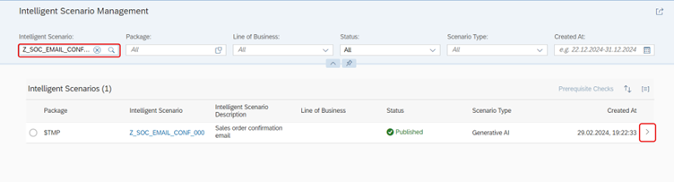
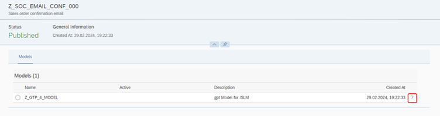
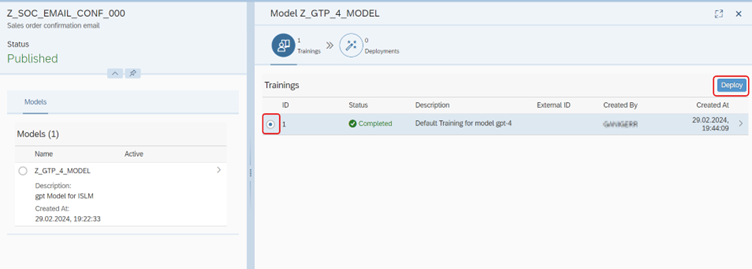
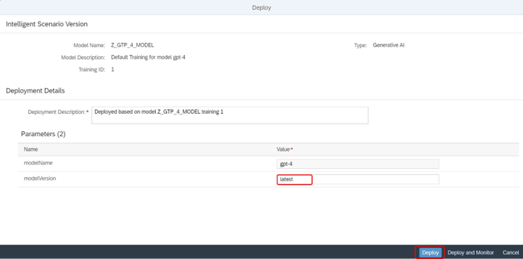
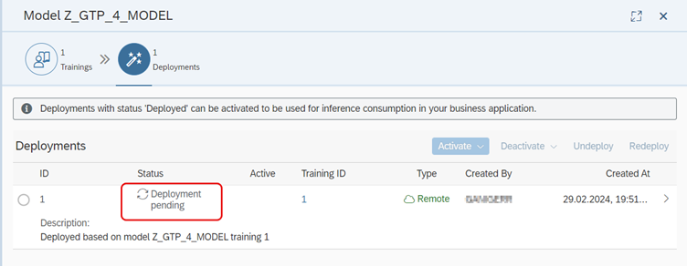
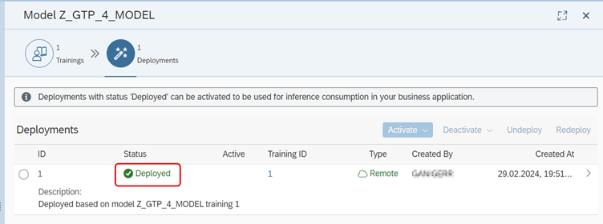
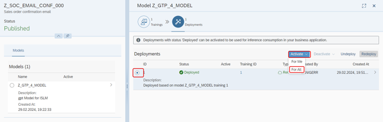
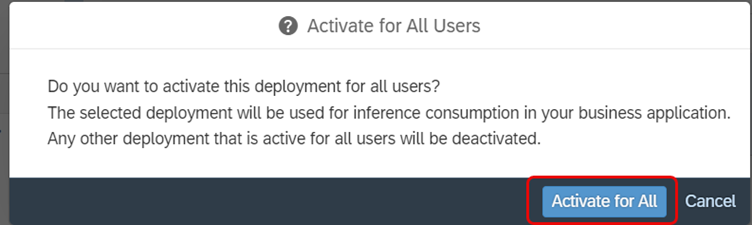

# Operate the Intelligent Scenario
Once the Intelligent Scenario has been connected GPT-4 model, we need to operate Intelligent scenario now.


1. Open the **Intelligent Scenarios Management** app in Fiori Launchpad by Ctrl + Click [here](https://ldai1ui3.wdf.sap.corp:44332/sap/bc/ui5_ui5/ui2/ushell/shells/abap/FioriLaunchpad.html?sap-language=EN&sap-client=000#IntelligentScenario-manage).
The login credentials can be found Ctrl + Click [here](cheat_sheet.md).
<br/>
   
   
2. Search the scenario that you have created:
```
Z_SOC_EMAIL_CONF_###
``` 
where **###** is your attendee id. 
Navigate to the details page by clicking the '**>**' icon.      

     
3. Select the Model.            


4. Click on the **Deploy button** to trigger the deployment.


5. Ensure that Model Version value is `latest`. Click on **Deploy** button.


6. New Deployment will be created in **Deployment Pending** status.

 
7. Monitor the status of Deployment and check the status changes to **Deployed**.



6. Activate the deployment in Deployed Status for productive Usage in Business Application. Select the Deployment and click on **Activate** button. Choose **For All** option.            


7. Click **Activation for All** button.         


   

Well done, you just deployed your first model and activated as well..!

You can continue with the next exercise - [Consume Inference by executing prompt](online_inference.md)
