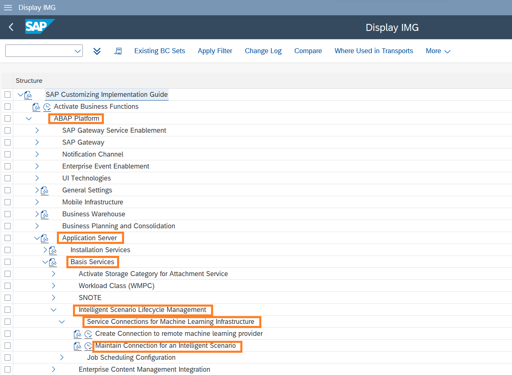
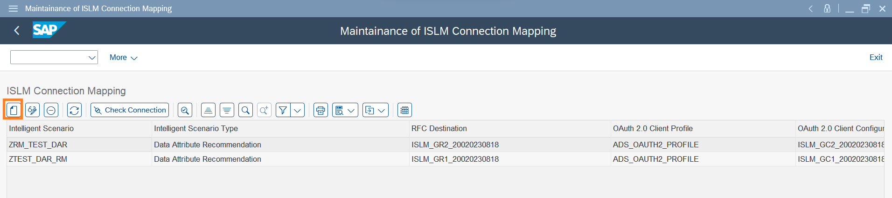
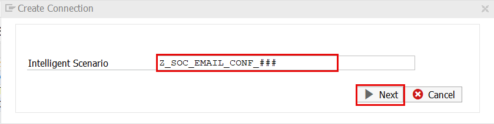
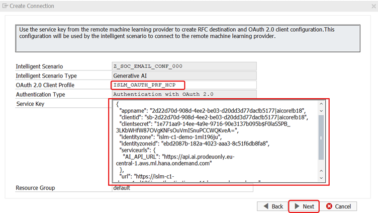
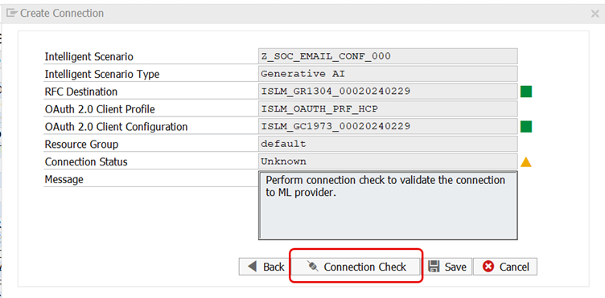
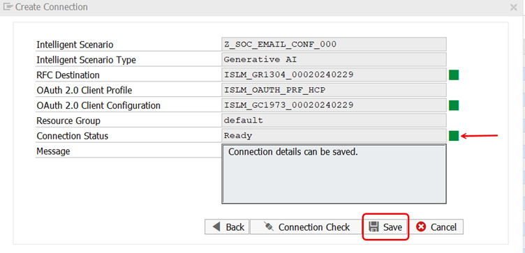

# Connect to GPT-4 model
Once the Intelligent Scenario is published, set up the connection between and Intelligent Scenario and GPT-4 model.
To access the GPT-4 models we need SAP AICORE instance which is hosted in SAP BTP.
SAP AICORE service key details are mentioned in the [Cheat Sheet](cheat_sheet.md).


1. Open the SAP GUI system that you have added in first step. Ctrl + Click [here](cheat_sheet.md) for login credentials.
   
2. Open the IMG activity via 'spro' transaction code, click on 'SAP Reference IMG'

     
3. Navigate to ABAP Platform >Application Server >Basis Services >Intelligent Scenario Lifecycle Management> Service Connections for Machine Learning Infrastructure > Maintain Connection for an Intelligent Scenario. 

    

4. Click on Execute 


   
5. The ISLM Connection Mapping window opens. Click the **Create Connection** icon.

     
6.  Input the Intelligent Scenario Name:
```
Z_SOC_EMAIL_CONF_###
```
where **###** is your attendee id. and click on **Next**.

    

7. Enter the OAuth 2.0 Client Profile given below:
```
ISLM_OAUTH_PRF_HCP
```
    
8. Paste the service key details maintained in [Cheat Sheet](cheat_sheet.md).                                                                                 
**Note**: Use the service key corresponding to your Attendee ID group.
   
    

8. Perform **Connection Check** to know the health of ML provider.

    
9. Check the Connection Status changes to **Ready**. Click **Save**. 
                               

10. New entry will be added to the table.

Well done, you just established connection between Intelligent scenario and GPT-4 model..!

You can continue with the next exercise - [Operate the Intelligent Scenario](Operate.md)
