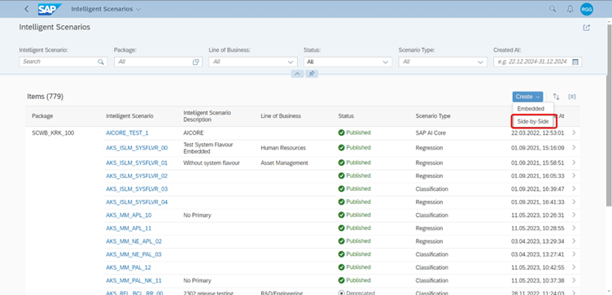
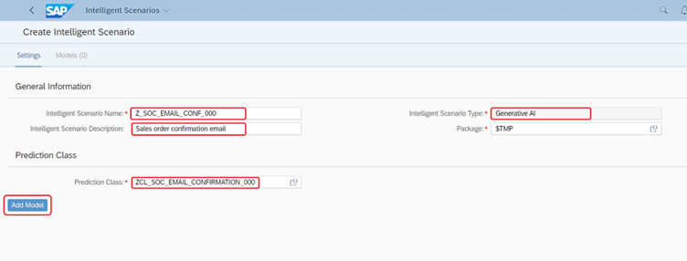
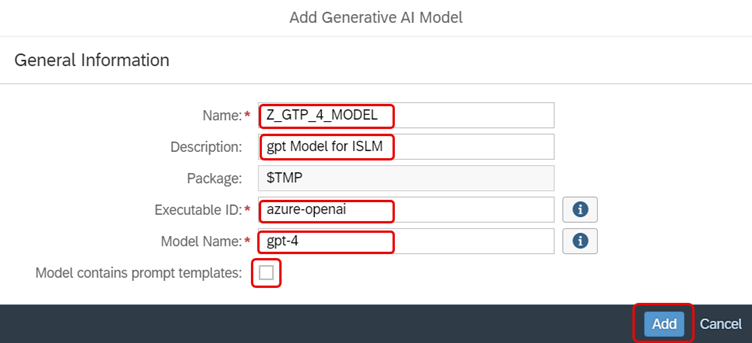
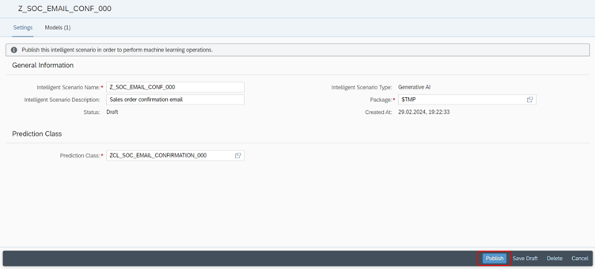
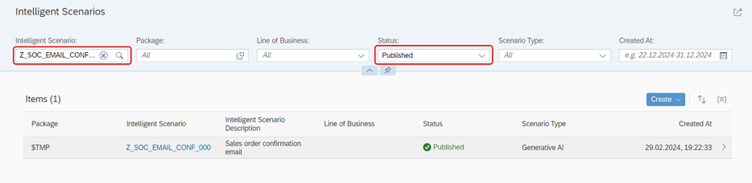

# Create a new Intelligent Scenario

The **Intelligent Scenarios** app is used to create intelligent scenarios, review, and publish them, and to make them available in the Intelligent Scenario Management app.

In this step, you will create a new intelligent scenario to **generate Sales Order Confirmation email to customer using GPT-4 model**.


1. Open the browser and navigate to the **Intelligent Scenarios** app in Fiori Launchpad by Ctrl + Click [here](https://ldai1ui3.wdf.sap.corp:44332/sap/bc/ui5_ui5/ui2/ushell/shells/abap/FioriLaunchpad.html?sap-language=EN&sap-client=000#IntelligentScenario-register). 
The login credentials are maintained Ctrl + Click [here](cheat_sheet.md).
   
2. Click the **Create** button and choose **Side-by-Side**.

  
3. Provide the required information in the screen:
	1. **Intelligent Scenario Name**: Enter a unique name starting with Z, such as:
```
Z_SOC_EMAIL_CONF_###
``` 
where **###** is your attendee id.
	2. **Intelligent Scenario Description**: Enter a description for the Intelligent Scenario.
	3. **Intelligent Scenario Type**: Generative AI
	4. **Prediction Class**: Select the prediction class that you have created in the previous step.
```
ZCL_SOC_EMAIL_CONFIRMATION_###
``` 
where **###** is your attendee id.
	5. Click on the **Add Model** button.

    
    
4. The **Add Generative AI Model** screen will pop up. Provide information as mentioned below:
	1. **Name**: Enter the below model name:
```
Z_GTP_4_MODEL
```
.
	2. **Description**: Enter a description.
	3. **Executable ID**: Enter the below executable id:
```
azure-openai
```
.
	4. **Model Name**: Enter the below model name:
```
gpt-4
```
.
	5. **Uncheck** the checkbox which says **Model contains prompt templates**, and click on the **Add** button.    


5. The scenario is now created in Draft Status. Click on **Publish** button. You will receive a message that Intelligent Scenario is published.


    
6. Search the Intelligent Scenario created by you by entering the **Intelligent Scenario name** and selecting **Status = Published** filter.

    

Well done, you just created your Intelligent Scenario.

You can continue with the next exercise - [Connect to GPT-4 model](connect_with_tcode.md)

      
