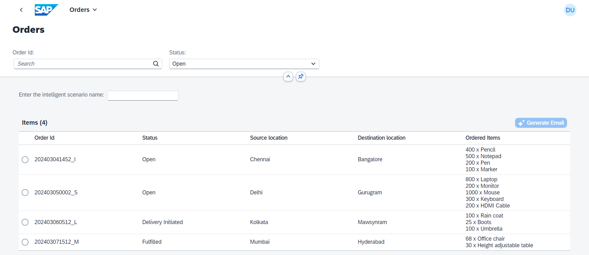
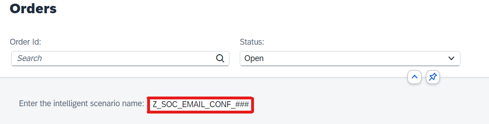
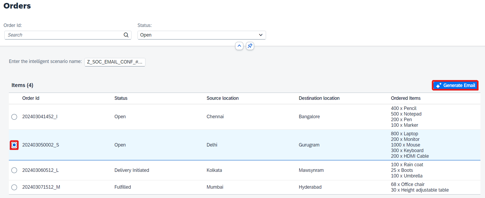
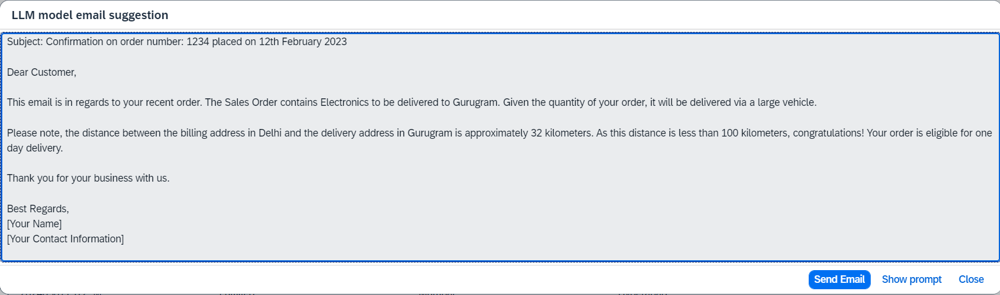
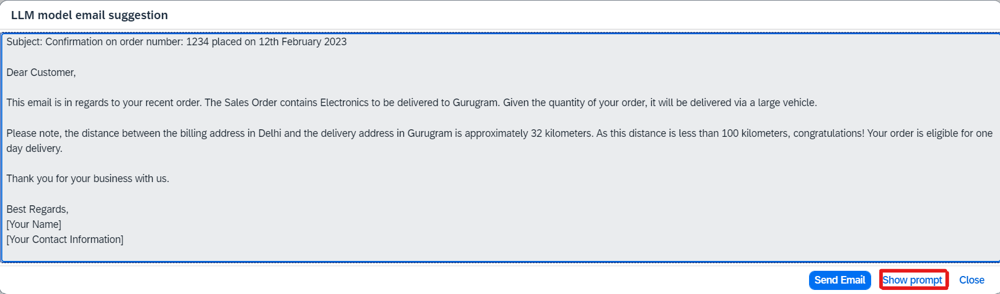

# Consume Inference by executing prompt

1. Open the browser and navigate to the **Demo Sales Order** app in Fiori Launchpad by Ctrl + Click [here](https://ldai1ui3.wdf.sap.corp:44332/sap/bc/ui5_ui5/ui2/ushell/shells/abap/FioriLaunchpad.html?sap-language=EN&sap-client=000#IslmDcomDemo2024-execute&/handson).
The login credentials are maintained Ctrl + Click [here](cheat_sheet.md).



2. Enter the intelligent scenario name that you have created:
```
Z_SOC_EMAIL_CONF_###
``` 
where **###** is your attendee id.



3. Select any of the Orders with **Open** status. And click on **Generate Email** button.



4. The generated email response by GPT-4 model will be displayed in dialog.
**Note:** The GPT-4 model takes few seconds to respond.



5. If you would like to view the prompt sent to the GPT-4 model, click on **Show prompt** button.



6. Try to generate email for other Open orders.
<br/>

Congratulations!!!!       
You have successfully created a GPT-4 model and consumed the inference from it in SAP S/4HANA system.                                           
You can continue to the [Summary](summary.md)
