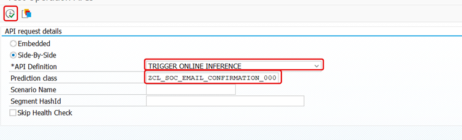
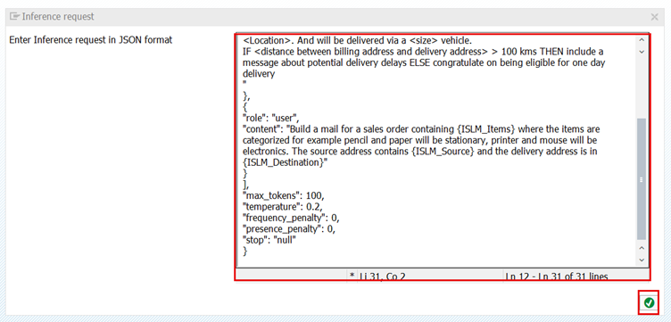

# Consume Inference by executing prompt

1. Open SAP GUI system that you have added in first step.

2. In the command field, enter below transaction code:
```
ISLM_OP_API
```
.

3. Select **Side-By-Side** radio button, and provide the following details:
    1. API Definition: **TRIGGER ONLINE INFERENCE**
    2. Prediction class: The prediction class created by you:
```
ZCL_SOC_EMAIL_CONFIRMATION_###
``` 
where ### is your attendee id. And click on Execute button.                


4. An Inference request dialog will be opened. Provide the json in the input field and click on OK button.     
```json
{
"messages": [
{
"role": "system",
"content": "You are a sales executive who is responsible for reaching out to customers for confirming or declining their orders. Evaluate the size of the delivery vehicle based on the number of items. Calculate the distance between the billing and delivery location in kilometers. The subject of email should be of format <Confirmation on order number: {order_number} placed on {booking_date}> The body of email should be of format: SO contains <Category> to be delivered to <Location>. And will be delivered via a <size> vehicle. IF <distance between billing address and delivery address> > 100 kms THEN include a message about potential delivery delays ELSE congratulate on being eligible for one day delivery"
},
{
"role": "user",
"content": "Build a mail for a sales order containing 10 pencils, 40 printers, 12 monitors where the items are categorized for example pencil and paper will be stationary, printer and mouse will be electronics. The source address contains Chennai and the delivery address is in Mumbai"
}
],
"max_tokens": 100,
"temperature": 0.2,
"frequency_penalty": 0,
"presence_penalty": 0,
"stop": "null"
}
```                                                                                                                                     
                                                                                                 
<br/>
  
5. The response from GPT-4 model will be displayed. The email response is suggested by GPT-4 model for the items, source and destination locations mentioned in the prompt.
<br/>
<br/>

Congratulations!!!!                                                                                                           
You have successfully created a GPT-4 model and consumed the inference from it in SAP S/4HANA system.                                           
You can continue to the [Summary](summary.md)
