### Add System to SAP Logon

1. Launch SAP Logon application on your computer.
   
2.	Click on **New** and select **Connection**, this action will open a dialog box for adding a new connection.
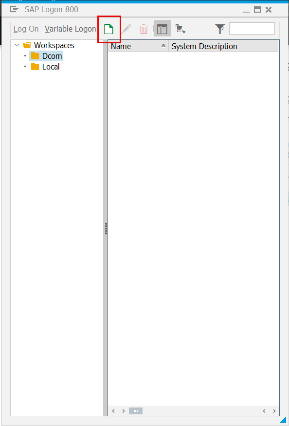
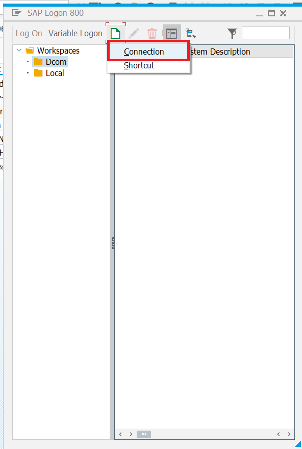

3. Search for **ODE** in the filter bar and click **Next**.
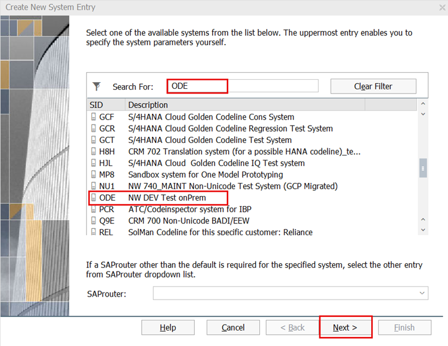

    
4. Select the public server and click **Next**.
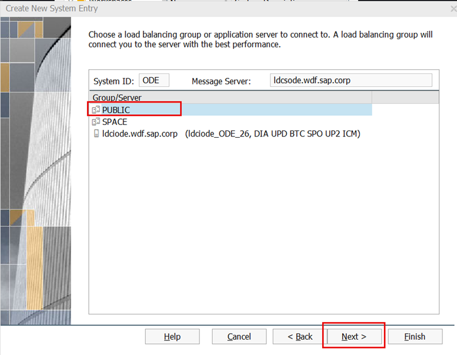
<br/>

5. Verify the details as shown in the screenshot and click **Next**.
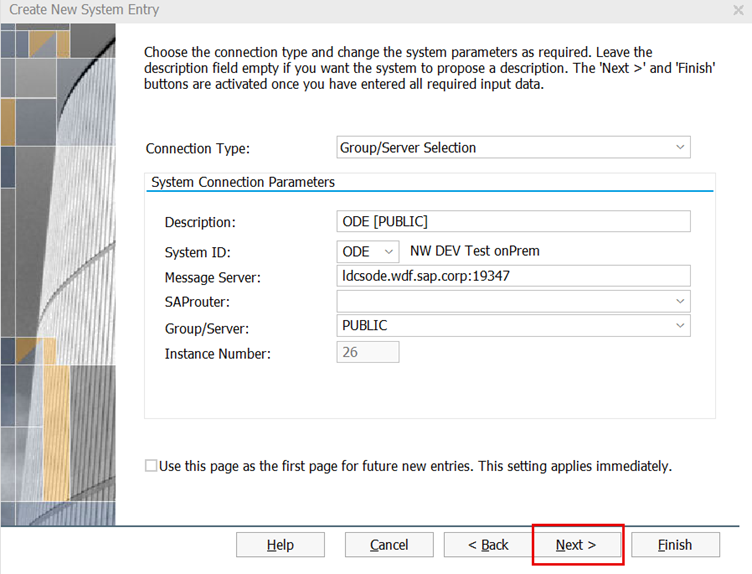
<br/>

6. Uncheck the **Activate Secure Network Communication** and click **Next**.
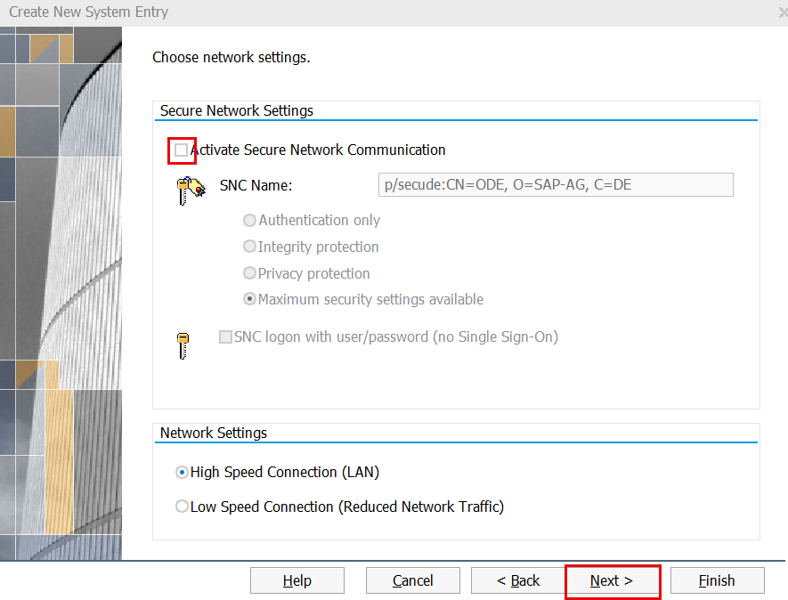
<br/>

7. Select Language as **Default** and click **Finish**
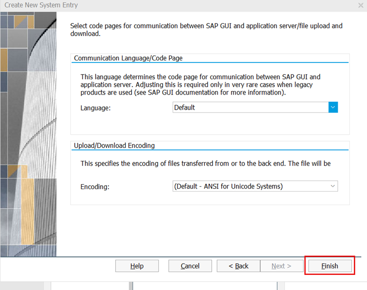
<br/>

Well done, you just added ODE system to your SAP Logon.
<br/>
<br/>

### Create Prediction Class
1. Launch SAP Logon application on your computer and login to ODE system.                  
Ctrl + Click [here](cheat_sheet.md) for login credentials.
  
2. In the **command** field, enter **SE24** transaction code.

  
3. In the initial screen of the Class Builder, enter the name of the class given below, and click on the **Copy** button. 
```
ZCL_SOC_EMAIL_CONFIRMATION_000
``` 
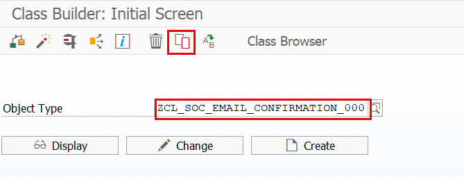
       
    
4. A dialog box will appear prompting you to enter a new name for the copied class. Provide a unique name such as 
```
ZCL_SOC_EMAIL_CONFIRMATION_###
``` 
where ### is your attendee id. 
Click on the **Continue** button.
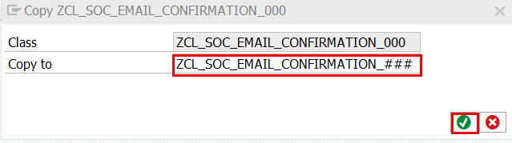

5. A pop-up requesting transport and package details appears. Select **Local Object**.
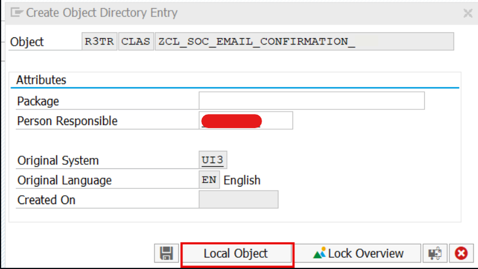

6. Activate the new class by clicking the **Activate** button.
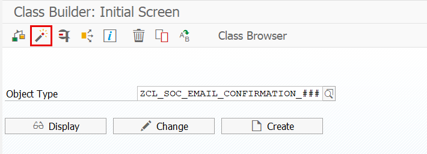

Well done, you just finished prerequisites and can start with the exercise - [Create a new Intelligent Scenario](create.md)
     
