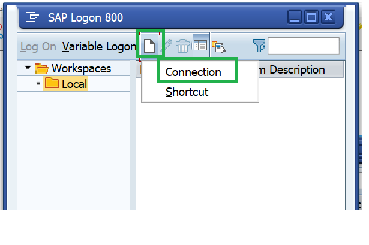
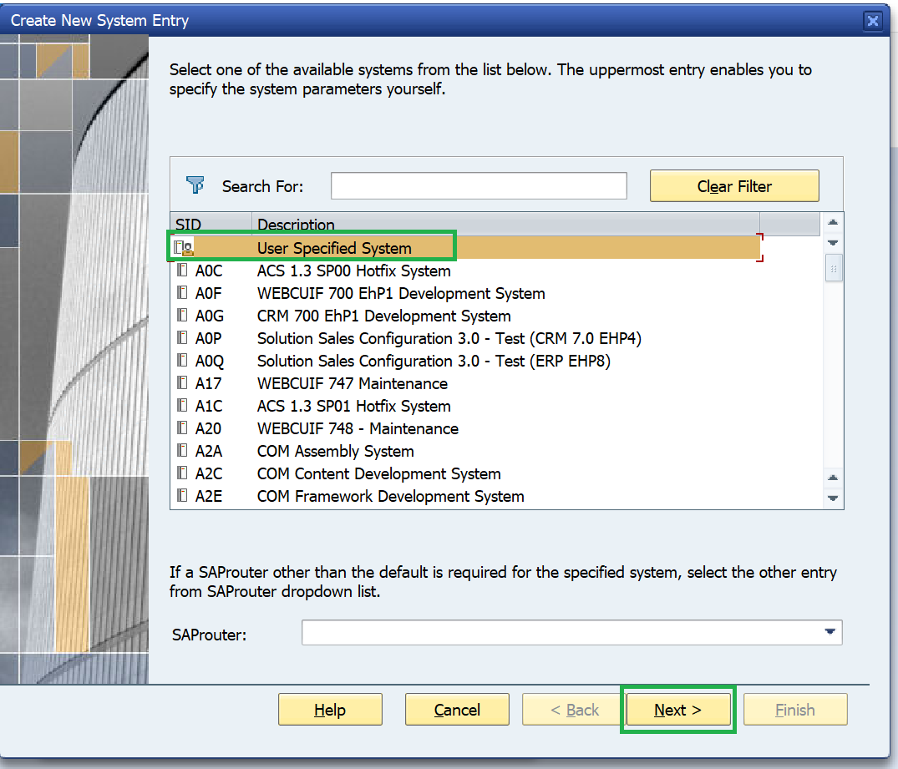
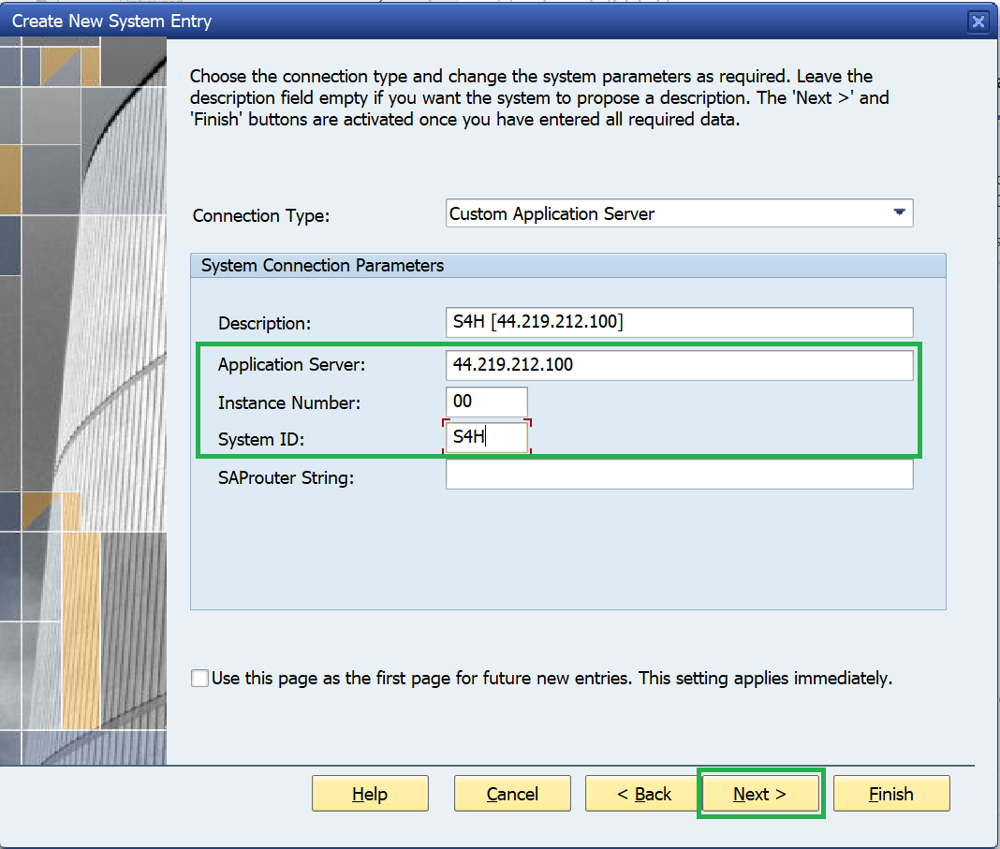
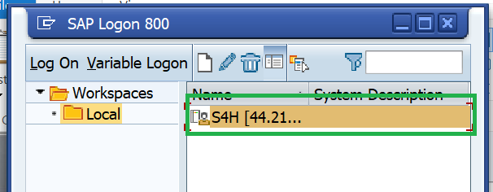

# Prerequisites 

- Add the S/4HANA system to SAP Logon
  - Click on **New** and select **Connection**.  
  
  - Select **User Specified System** and click **Next**. 
  
  - Enter system details, refer cheat_sheet (if required) and click **Next**. 
  
  - Click **Next** and **Finish**.
  - System should be visible on SAP Logon.
  
- Attendee ID - ensures your ISLM Scenario name is unique across all participants.
- Login credentials (if required): 
  - If prompted for a login ID and password, refer to the cheat_sheet.
  - The user ID and password are the same for both Fiori and Backend ABAP systems.
