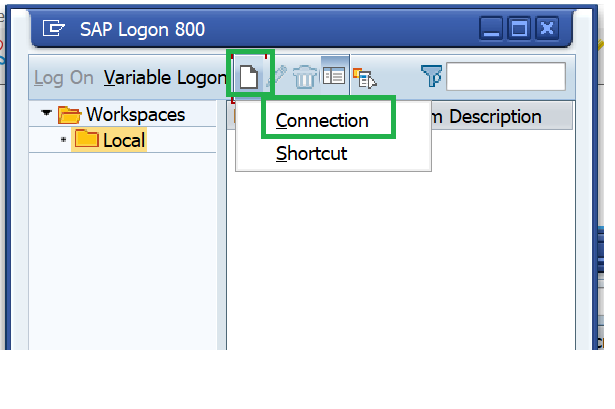
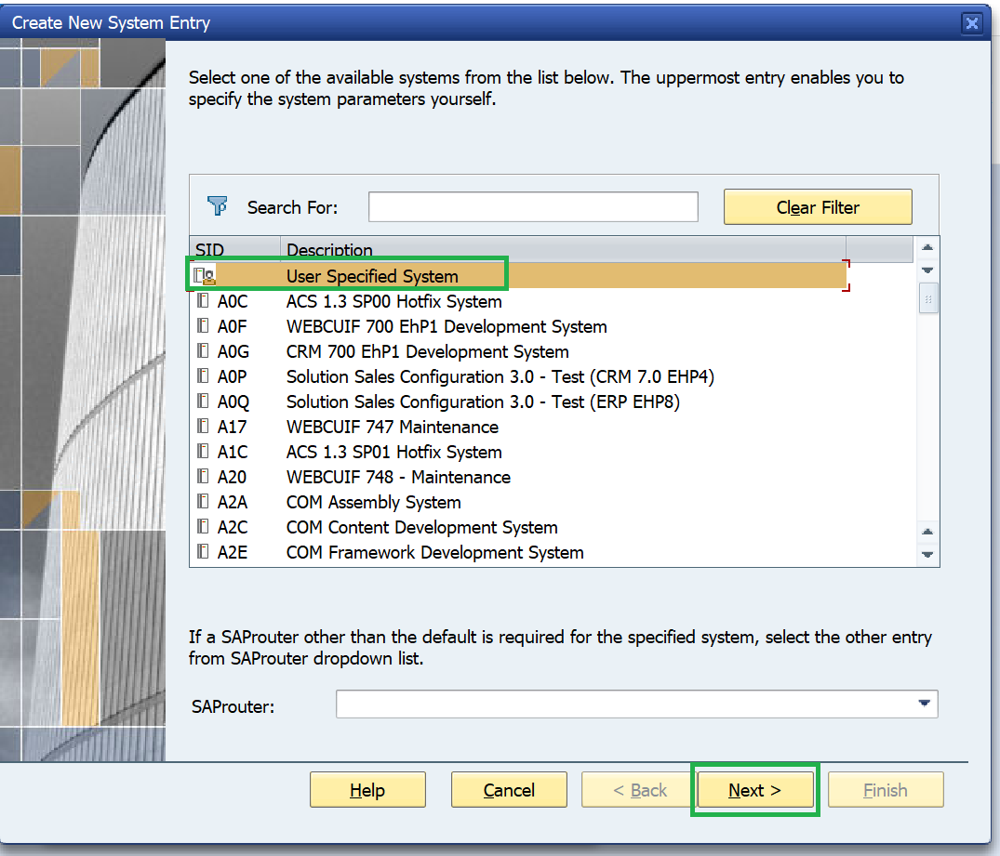
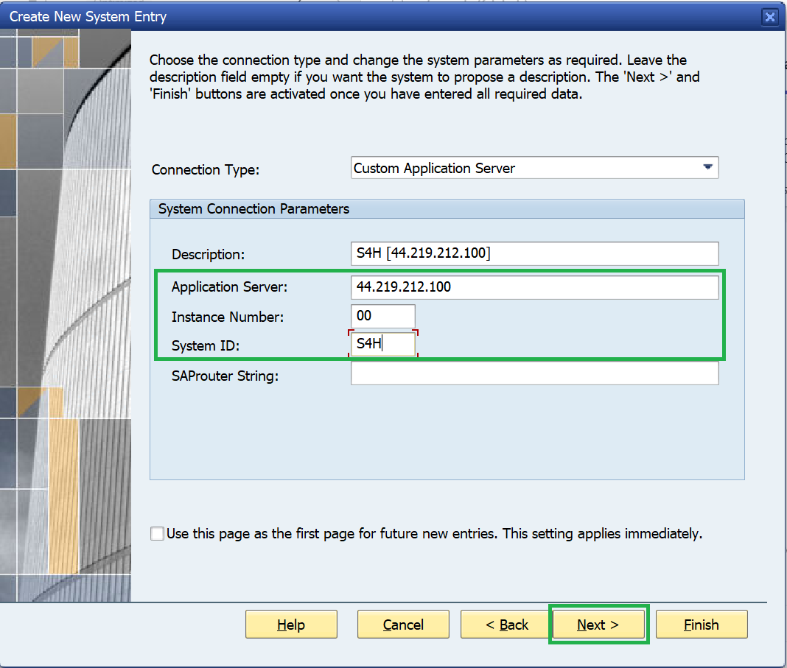
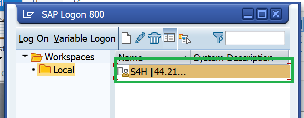
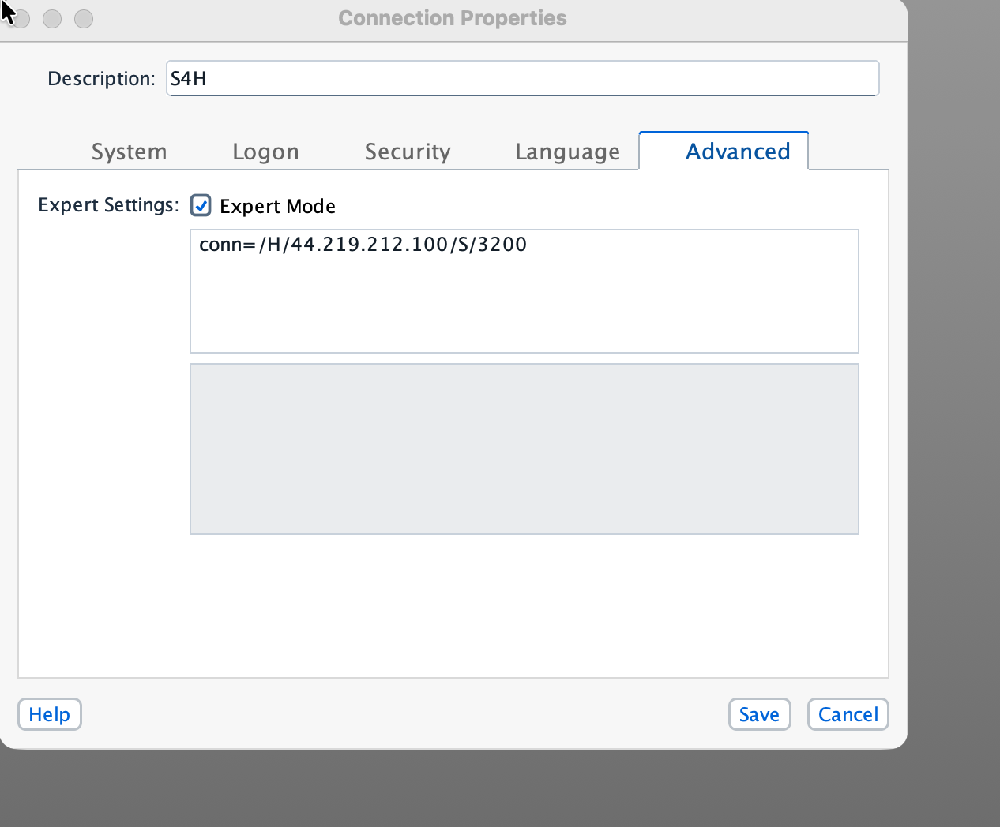

## 1. Add the S/4HANA system to SAP Logon

### Windows

- Click on **New** and select **Connection**.

- Select **User Specified System** and click **Next**.

- Enter the system details below (or refer to the cheat sheet if required) and click **Next**.
  - **System ID (SID)**: S4H
  - **Application Server**: 44.219.212.100
  - **Instance Number**: 00
  - **Client**: 100
  - **Language**: EN

- Click **Next** and **Finish**.

- The system should now be visible in SAP Logon.

### Mac

- Open SAP Logon (SAP GUI).

- Click **New Entry** (the "+" or "New Item" button in the toolbar).

- In the dialog, enter the description and select the **Advanced** tab.

- Enable **Expert Mode** and enter your IP address.

- Click **Save**. The system should now appear in your SAP Logon list.
