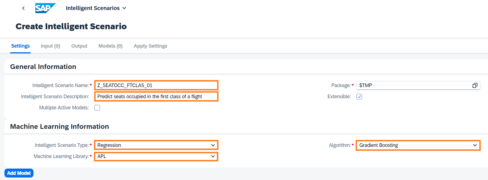
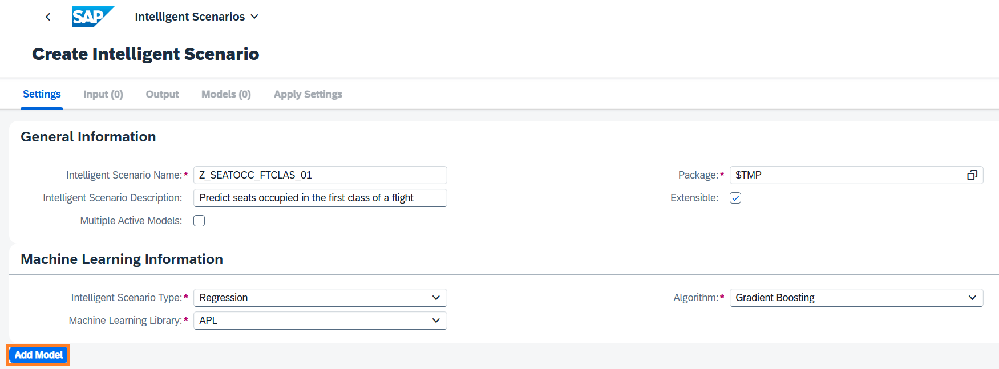
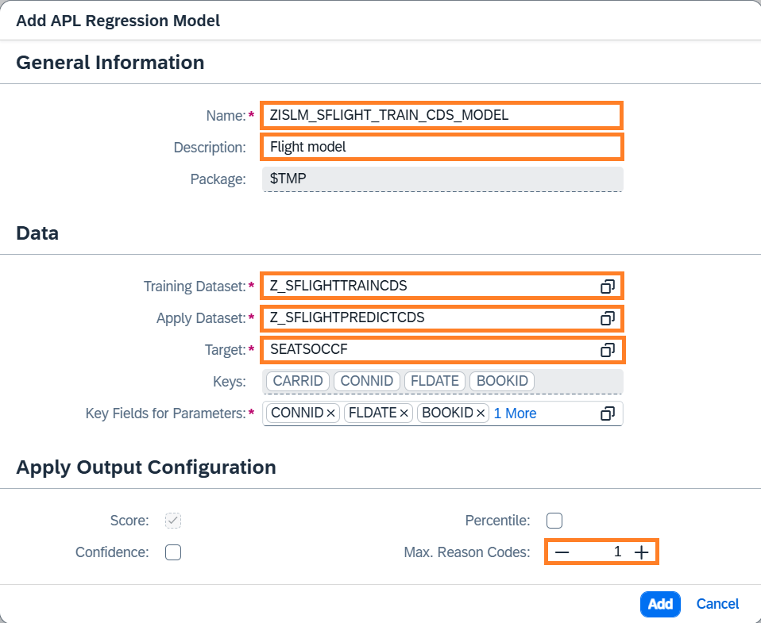
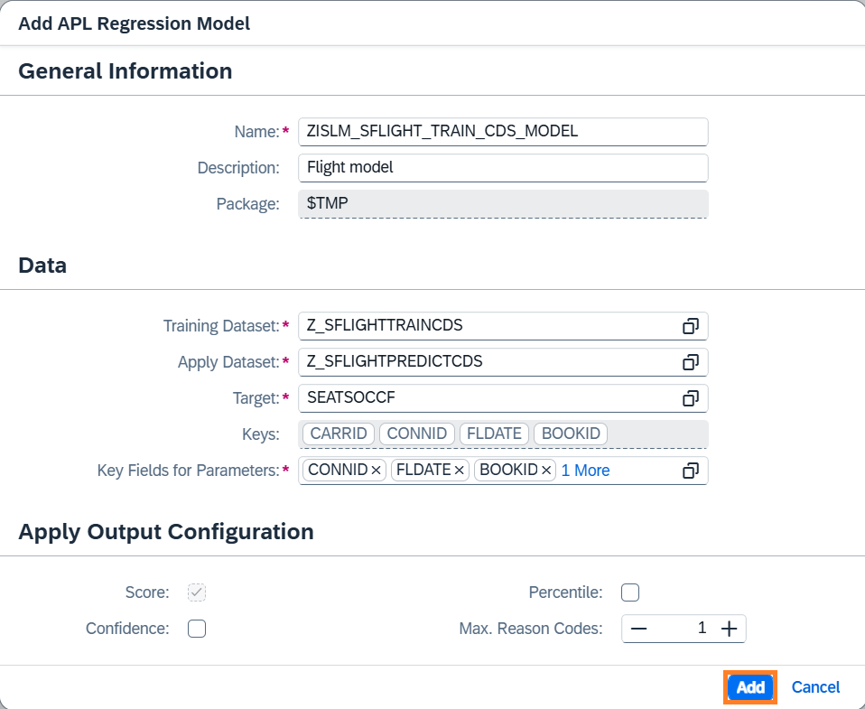
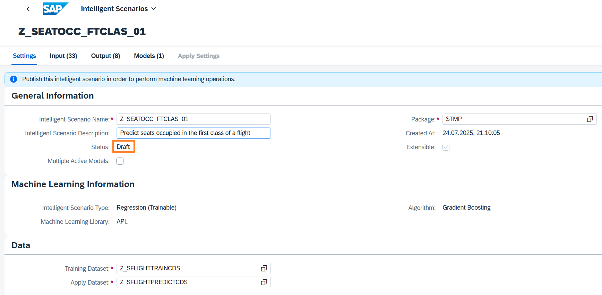
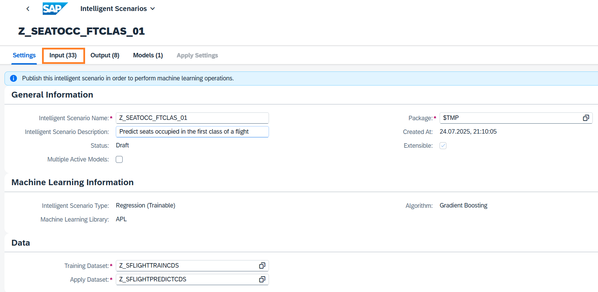
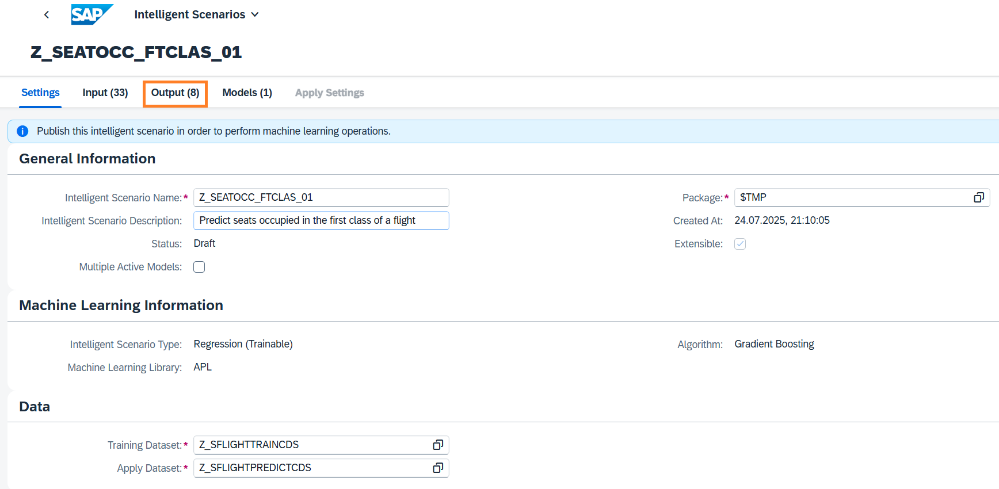
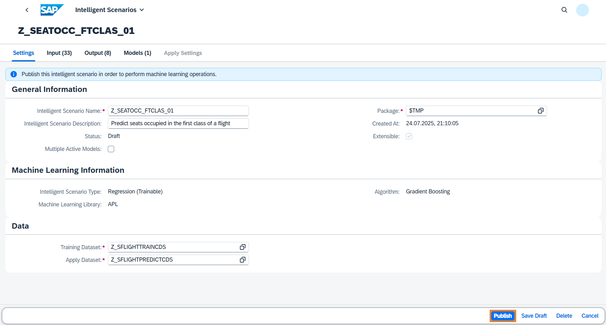
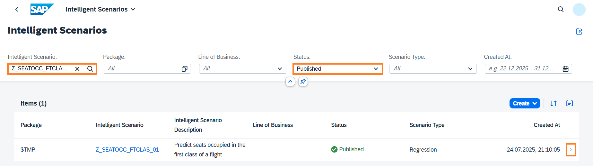
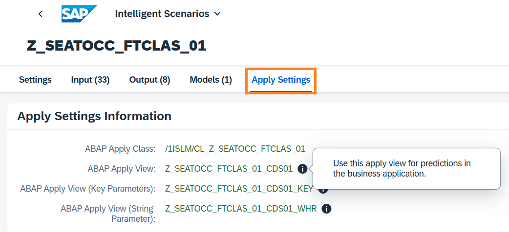

# Create Intelligent Scenario

The Intelligent Scenarios app is used to create intelligent scenarios, review, and publish them, and to make them available in the Intelligent Scenario Management app.

In this step, you’ll create a new intelligent scenario to predict the airplane seats occupation in the first class of a flight using SAP HANA ML algorithm.

For this use case we will use regression model with Gradient Boosting algorithm.

SAP HANA APL lets you build and apply different types of predictive models, such as classification, regression, and time series forecasting models.

Gradient Boosting regression model type provides a more accurate modeling result than the legacy regression model.

1. Open the Fiori Launchpad by clicking [here](https://18.214.3.29:44301/sap/bc/ui5_ui5/ui2/ushell/shells/abap/FioriLaunchpad.html?sap-client=100&sap-language=EN#Shell-home){:target="\_blank"}. Input the username and password provided in the cheat sheet. Click the **Intelligent Scenario** app.
   

2. Click the **Create** button and choose **Embedded**. In Embedded approach, a business application, for example SAP S/4HANA runs in the same stack as its machine learning provider SAP HANA ML and it provides analytics libraries **SAP HANA Automated Predictive Library (APL)** or **SAP HANA Predictive Analysis Library (PAL)**.
   

3. Click the **Do Not Show Again and Close** button in the Onboarding Dialog.
   

4. Provide the required information in the screen: - **Intelligent Scenario Name**: Enter a unique name starting with Z, such as `Z_SEATOCC_FTCLAS_###`, where ### is your attendee id. - **Intelligent Scenario Description**: `Predict seats occupied in the first class of a flight`. - **Intelligent Scenario Type**: Select `Regression` type. - **Algorithm**: Select `Gradient Boosting`. - **Machine Learning Library**: Select `APL`.
   

5. Click the **Add Model** button.
   

6. The APL Regression Model screen will pop up. Provide information as mentioned below: - **Name**: Enter a model name starting with Z - `ZISLM_SFLIGHT_TRAIN_CDS_MODEL`. - **Description**: Enter the description - `Flight model`. - **Training Dataset**: `Z_SFLIGHTTRAINCDS`. Training Dataset to be used for training the model. - **Apply Dataset**: `Z_SFLIGHTPREDICTCDS`. Apply dataset is Dataset used for prediction. **Note that apply dataset is different from training dataset.** - **Target**: `SEATSOCCF`. Target variable is field whose value you want to predict. - **Max Reason Code:** `1` Number of reason codes you want to generate.  Reason codes are variables whose values have the most influence in a score-based decision (typically a risk score). The variables for which the contribution is the most influential are selected as the most important reason codes.  Apply output configuration has the selected metrics that are added in the intelligent scenario output and used for prediction.
   

7. Click the **Add** button.
   

8. The scenario is now created in **Draft** Status.
   

9. View the **Input Tab** which displays the **Key**, **Input**, and **Target** fields.  The Input variable is considered for modelling.  The Key variable is a key field of the dataset and is also considered for modelling.  The Target variable is the variable whose values are to be modelled and predicted by other variables.
   

10. View the **Output tab** which displays the **Key**, **Target**, and **Prediction** fields.  The Prediction variable includes the calculated result.
    

11. Scenario is now ready to be published. Click on **Publish** button. You will receive a message that Intelligent Scenario is published.
    

12. Search the Intelligent Scenario created by you by entering the **Intelligent Scenario name** as `Z_SEATOCC_FTCLAS_###`, where ### is your attendee id and **Status = Published**.
    Navigate to the details page by clicking the `>` icon.
    

13. Click on **Apply Setting** Tab. Three CDS views are generated for the intelligent scenario to allow easy access to the predictions. Click the `i` icon to view the functionality & usage of each CDS view.
    

**Well done, you just created your first embedded Intelligent Scenario.**
