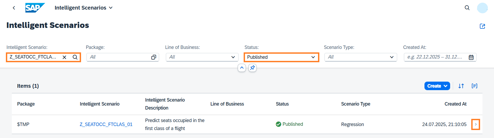
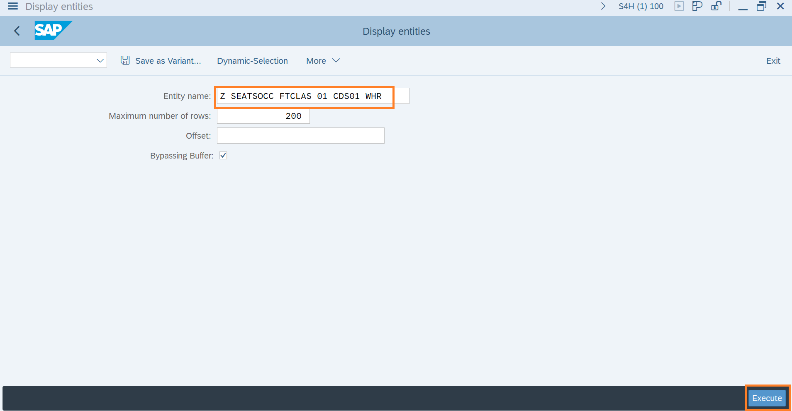

# Visualizing Model Version Predictions

1. Open the Fiori Launchpad by clicking [here](https://18.214.3.29:44301/sap/bc/ui5_ui5/ui2/ushell/shells/abap/FioriLaunchpad.html?sap-client=100&sap-language=EN#Shell-home){:target="\_blank"}. Input the username and password provided in the cheat sheet. Click on the **Intelligent Scenario** app.
   

2. Search the Intelligent Scenario created by you by entering the **Intelligent Scenario name** as `Z_SEATOCC_FTCLAS_###`, where ### is your attendee id and **Status = Published**. Navigate to the details page by clicking the `>` icon.
   

3. Click on **Apply Setting** Tab. You can find the 3 Apply CDS views in this tab. We can see the predictions for each view in next steps.
   

4. You will use the SAP GUI to view the model's prediction. Login to **S4H/100** system via SAP GUI, with the given credentials in cheat sheet.

5. Type `/n se38` in the command field and press **ENTER**.
   

6. Search for report **RUT_DDLS_DATA_PREVIEW** and click on **Execute(F8)**.
   

7. Enter the ISLM generated 1st CDS view of created Intelligent Scenario to view predictions from trained model. - CDS View will have following name **Z*SEATOCC_FTCLAS*###\_CDS01**, where ### is your attendee id. - Enter CDS View Name in Entity Name field and click on **Execute**.
   

8. You can scroll down and see the model's keys in the first four columns: **Airline Code, Flight Connection Number, Flight Date and Booking number.** - Column **SEATSOCCF** has the actual value of the seats occupied. - Column **GB_SCORE_SEATSOCCF** column has the predicted value of the occupied seats.
   

9. Goto **SE38** again and Search for report **RUT_DDLS_DATA_PREVIEW** and click on **Execute(F8)**. Enter the ISLM generated 2nd CDS view of created Intelligent Scenario to view predictions from trained model. - CDS View will have following name **Z*SEATOCC_FTCLAS*###\_CDS01_KEY**, where ### is your attendee id. - Enter CDS View Name in Entity Name field and click on **Execute**.
   

10. Provide below values to the respective CDS parameters: - P_BOOKID = `2274` - P_CARRID = `AZ` - P_CONNID = `555` - P_FLDATE = `20250813`
    
11. You can scroll down and see the model's keys in the first four columns: **Airline Code, Flight Connection Number, Flight Date and Booking number.** - Column **SEATSOCCF** has the actual value of the seats occupied. - Column **GB_SCORE_SEATSOCCF** column has the predicted value of the occupied seats.
    

12. Goto SE38 again and Search for report **RUT_DDLS_DATA_PREVIEW** and click on Execute(F8). Enter the ISLM generated 3rd CDS view of created Intelligent Scenario to view predictions from trained model. - CDS View will have following name **Z*SEATOCC_FTCLAS*###\_CDS01_WHR**, where ### is your attendee i. - Enter CDS View Name in Entity Name field and click on **Execute**.
    

13. Provide below values to the respective CDS parameters - P_WHERE = `CONNID = 0017 AND FLDATE = 20250813`
    

14. You can scroll down and see the model's keys in the first four columns: **Airline Code, Flight Connection Number, Flight Date and Booking number.** - Column **SEATSOCCF** has the actual value of the seats occupied. - Column **GB_SCORE_SEATSOCCF** column has the predicted value of the occupied seats.
    

**Well done, you just visualized your trained model predictions..!**
