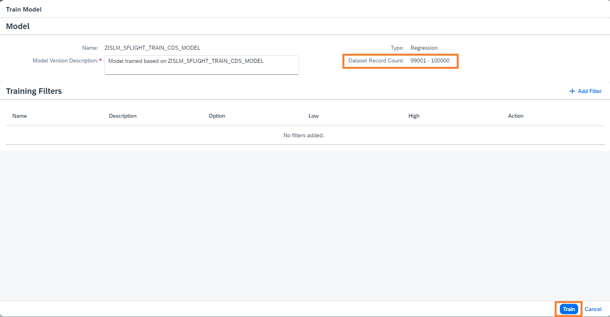
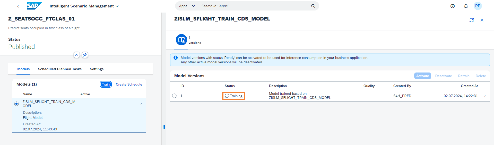

# Operating the Intelligent Scenario

Once the Intelligent Scenario is published, the Intelligent Scenario Management app helps you to train, monitor the model quality and activate the model for productive usage.

In this section, you will use the Intelligent Scenario Management app to perform ML operations.

1. Open the Fiori Launchpad by clicking [here](https://18.214.3.29:44301/sap/bc/ui5_ui5/ui2/ushell/shells/abap/FioriLaunchpad.html?sap-client=100&sap-language=EN#Shell-home){:target="\_blank"}. Click on the **Intelligent Scenario Management** app.
   

2. Search the **First-Class Seats Occupied** scenario created by you and navigate to the details page by clicking the `>` icon.
   

3. Select the Model and click on the **Train button** to trigger the training.
   

4. In the Model section, view the Dataset Record Count. Click on **Train** button.
   

5. New Model Version will be created in **Scheduled** status.
   

6. Monitor the status of the **Model Version** and check the status changes to **Training**.
   

7. Monitor the status of the Model Version and check the status changes to **Ready**.
   

8. Click on **'>'** icon to view Model Version Report.
   

9. View different tabs like **Quality Information and Debrief**. You can see attributes about data quality and what key influencers are affecting the predictions.
   - **Mean Absolute Error(MAE):** Average absolute difference between the predicted values and the actual values. The lower the better.
   - **Root Mean Square Error(RMSE):** RMSE is the square root of mean squared error. It measures the average difference between values predicted by a model and the actual values. RMSE tells us how close the actual values are to prediction values made by the model. The lower the better.
   - **Mean Absolute Percentage Error(MAPE)** Average of the absolute percentage errors of the predictions. The lower the better.
    
   

10. Choose the back icon  to navigate back to Model Versions screen.  Activate the model version to get the predictions from regression model. Select the Model Version and click the **Activate** button.
    

**Well done, you just Operated the Intelligent Scenario by training your first model.**
