# Schedule training

You can schedule a training for your intelligent scenarios. Once the trainings are scheduled, model versions are created automatically based on the selected frequency and preselected filters.

1. Open the Fiori Launchpad by clicking [here](https://18.214.3.29:44301/sap/bc/ui5_ui5/ui2/ushell/shells/abap/FioriLaunchpad.html?sap-client=100&sap-language=EN#Shell-home){:target="\_blank"}. Click on the **Intelligent Scenario Management** app.
   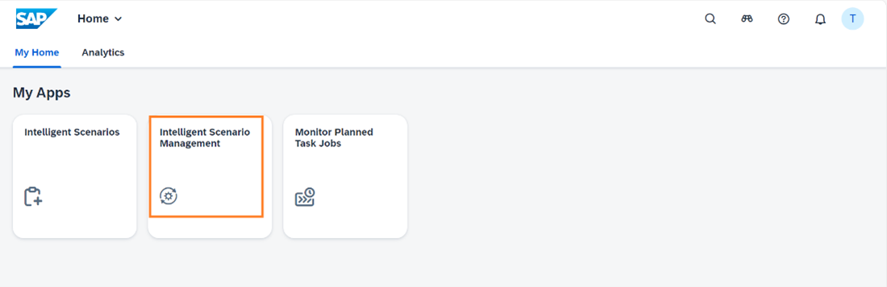

2. Search the **First-Class Seats Occupied** scenario created by you and navigate to the details page by clicking the **>** icon.
   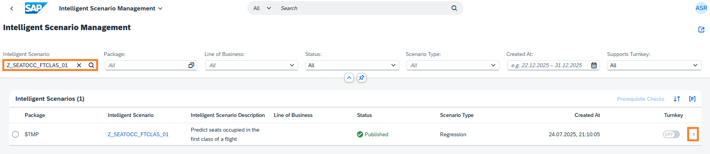

3. Click the **Create Schedule** button.
   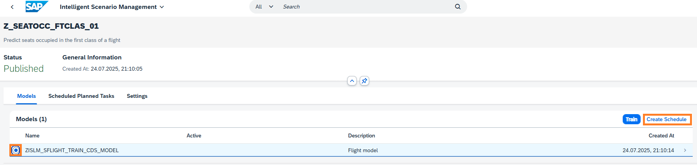

4. View the information displayed in the screen. Click on **Model Version** value help.
   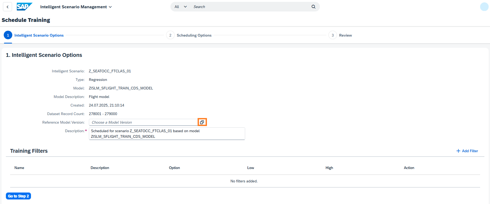

5. Select the reference Model Version.
   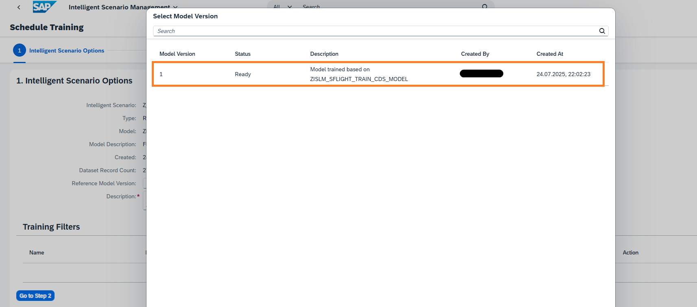

6. Click on **Go to Step 2**.
   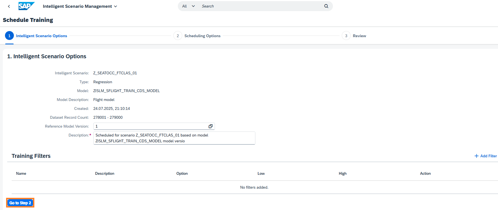

7. Review Scheduling Options automatically proposed by the system.
   - Enter the Start as **2 minutes later** than the system proposed time.
   - Schedule for **1 Occurrence(s)** and click on **Go to Step 3**.
   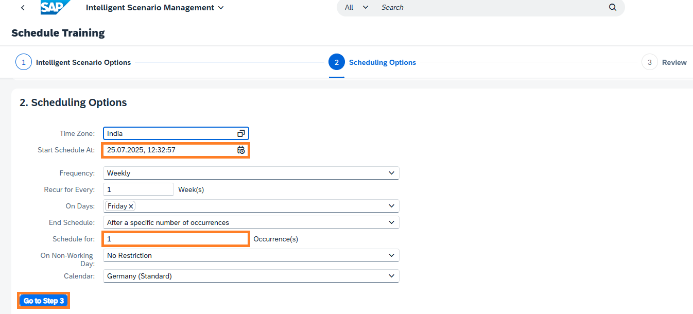

8. Review the section Intelligent Scenarios Details and Schedule Details. Click the **Create Schedule** button.
   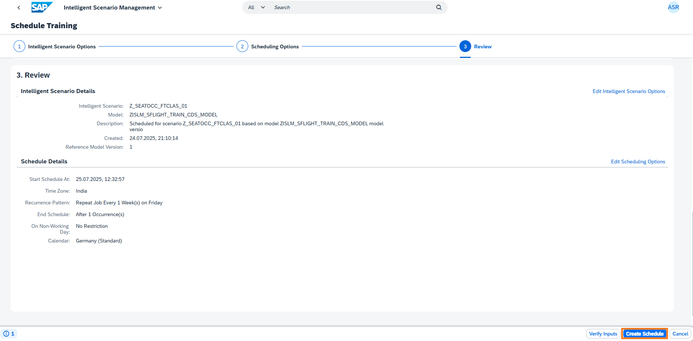

9. Click on **Schedule Planned Task** tab to view the planned task created as a result of scheduling of training. Please wait until the given start time of the task and status is completed.
   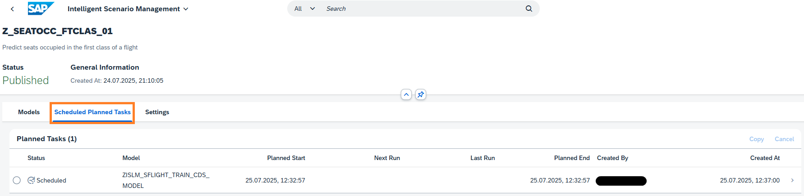

10. Once the status changes to **Completed**, click the **>** button.
    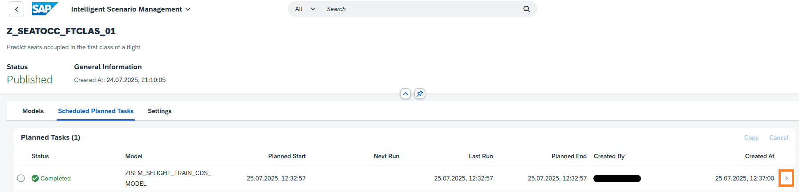

11. Review **scheduling Options** and **Scheduling Runs** tab.
    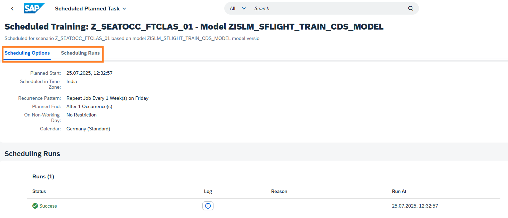

12. Click the highlighted icon to view the created Model Version.   **[Note]: This step will take time** as logs are opened in a dialog.
    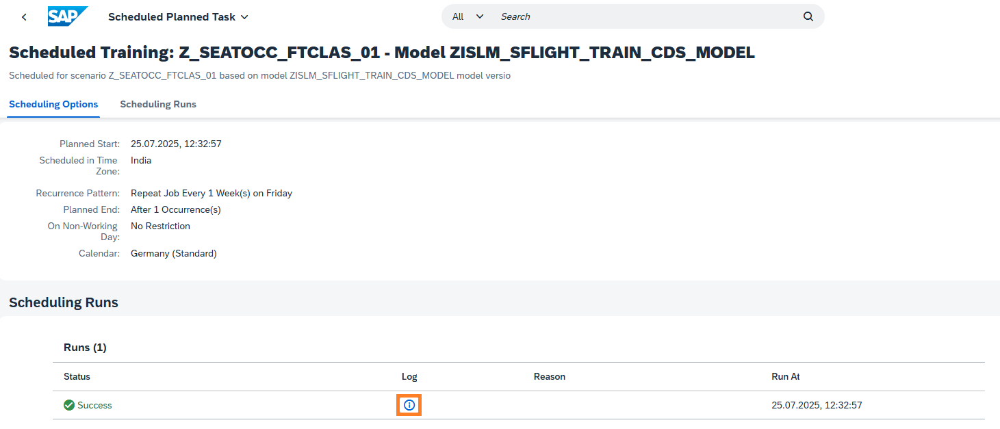

13. View the created **Model Version ID**.
    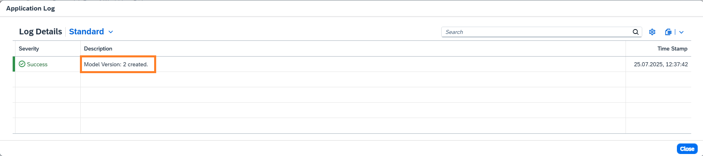

14. Close the **Application log** dialog and to navigate back Scheduled Planned Tasks screen by clicking 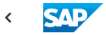. Select the **Models** tab and Click on **>** icon to view the created Model Version.
    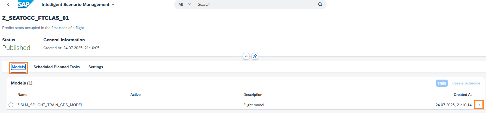

15. View the created Model Version as outcome of Scheduling of Training.
    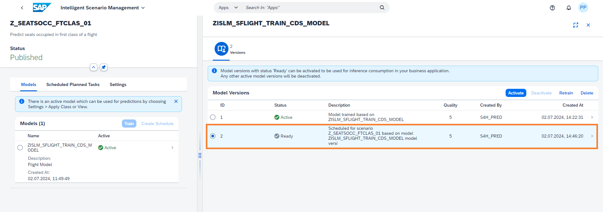

**Well done, you just scheduled training.**

🎉 Congratulations! 🎉
You have successfully completed the exercise.
