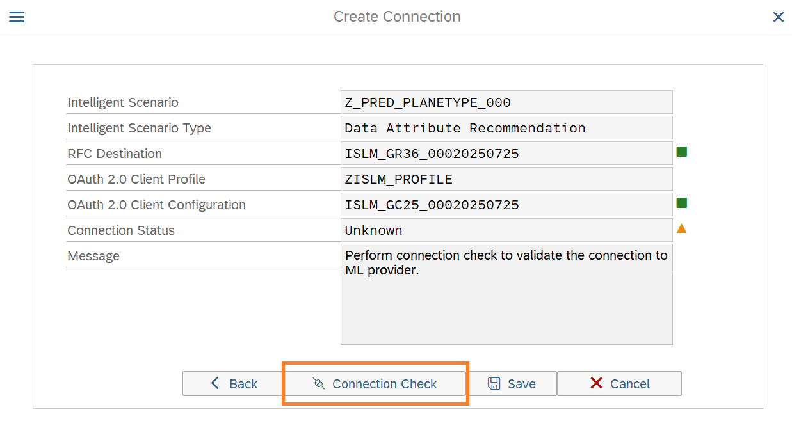
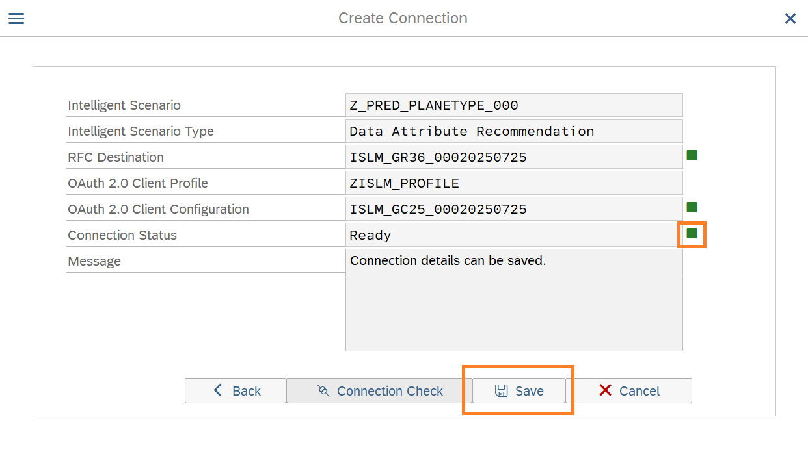

# Set up the connection for Intelligent Scenario to connect to BTP based ML service

Once the Intelligent Scenario is published, we need to maintain the connection for the intelligent scenario in SAP S/4 HANA with the Data Attribute Recommendation service in BTP. This service has already been provisioned in BTP and **service key** is available in the Cheat sheet.

1. Open transaction **/nSPRO** in **S4H** system via **SAP Logon**. And click **SAP Reference IMG** button.
   

2. Navigate to **ABAP Platform >Application Server >Basis Services >Intelligent Scenario Lifecycle Management> Service Connections for Machine Learning Infrastructure > Maintain Connection for an Intelligent Scenario**.
   

3. Click the **Execute** button.  

4. In the ISLM Connection Mapping screen, click the **Create Connection** icon.

5. Input the Intelligent Scenario Name created by you (`Z_PRED_PLANETYPE_###`, where ### is your attendee id) and click the **Next** button.
   

6. Enter the **Service Key** maintained in the cheat sheet.
   

7. Click the **Next** button.
   

8. Perform **Connection Check** to know the health of ML provider.
   

9. Ensure that the **Connection Status** changes to **Ready**. Click the **Save** button.
   

10. A new entry is added to the table.
    

**Well done, you just Set up the connection for Intelligent Scenario to connect to BTP based ML service.**
