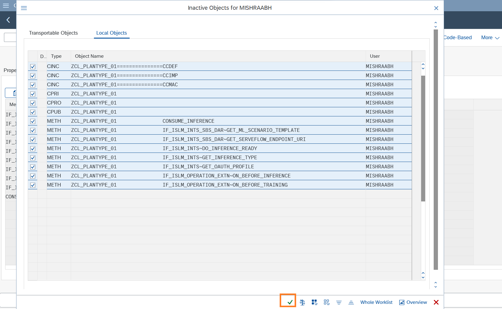
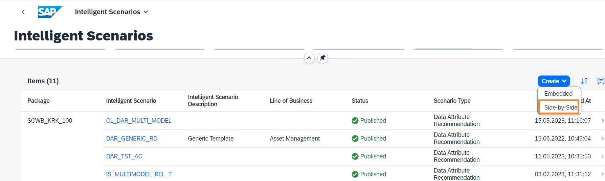

# Create and publish Intelligent Scenario

The Intelligent Scenarios app is used to create intelligent scenarios, review, and publish them, and to make them available in the Intelligent Scenario Management app. In this step, you’ll create a new intelligent scenario to predict the plane type using SAP BTP based ML service Data Attribute Recommendation.

Create a Prediction Class which defines the behavior of the scenario. Prediction class has methods to specify Inference type and ML Template for Data Attribute Recommendation. For this use case, we will use generic template which make use of Classification algorithm.

1. Open **SAP Logon** and logon to **S4H** system.
2. Open transaction `/nse24` and search for the ABAP class `ZCL_PLANTYPE_HO`.
   

3. Click the **Copy** button.
   

4. Provide the unique name in the **Copy to** field. Enter a unique name such as `ZCL_PLANTYPE_###`, where ### is your attendee id. And click the **tick** icon.
   

5. Click the **Local Object** button. 
   

6. The class is created in **Inactive** status. Click the **Display** button.
   

7. Click the **Activate** icon.
   

8. Click the **tick** icon.
   

9. Open the Fiori Launchpad by clicking [here](https://18.214.3.29:44301/sap/bc/ui5_ui5/ui2/ushell/shells/abap/FioriLaunchpad.html?sap-client=100&sap-language=EN#Shell-home){:target="\_blank"}. Click on the **Intelligent Scenario** app.
   

10. Click the **Create** button and choose **Side-by Side**.   This approach is commonly known as '**side-by-side**,' where the ML provider and the business application operate in separate stacks.
    

11. Provide the required information in the screen:
    - **Intelligent Scenario Name**: Enter a unique name starting with Z, such as `Z_PRED_PLANETYPE_###`, where ### is your attendee id mentioned in the cheat sheet.
    - **Intelligent Scenario Description**: `CLM Day Hands on 2025`
    - **Intelligent Scenario Type**: `Data Attribute Recommendation`
    

12. Ensure the **Data Management checkbox** is selected.

13. Click the value help for **Prediction Class**.
    

14. Click the **OK** button in the information box.
    

15. Click the **Add Model** button. The Add DAR Model dialog will pop up. Provide the following details:
    - **Name**: `Z_PRED_PLANETYPE_MOD`
    - **Description**: `Model for CLM Day 2025 - Hands on`
    - **Training Dataset**: `Z_SFLIGHT_DATA`
    

16. Click the value help for the **Inputs** field.
    

17. The **Select Model Inputs** dialog will pop up. Select all the Inputs expect `CARRID`, `CONNID`, `PLANETYPE`.   **Tip**: Use the Select All option and uncheck the CARRID, CONNID, PLANETYPE.
    

18. Select the relevant **Machine Learning Provider Type** as `Category` or `Number`, as displayed in the screnshot. And click the **Select** button.
    

19. Click the value help for the **Targets** field.
    

20. The **Select Model Targets** dialog will pop up. Select `PLANETYPE` and the corresponding **Machine Learning Provider Type** as `CATEGORY`. And click the **Select** button. 
    

21. Click the **Add** button.
    

22. The scenario is now created in **Draft** Status. You can view the input and output fields used to train the model in the **Input** and **Output** Tabs respectively. Also Scenario is now ready to be published.  Click on **Publish** button. You will receive a message that Intelligent Scenario is published.
    

23. Search the Intelligent Scenario created by you by entering the **Intelligent Scenario name** and **Status = Published**.
    

**Well done, you just created your first Side-by-side Intelligent Scenario.**
