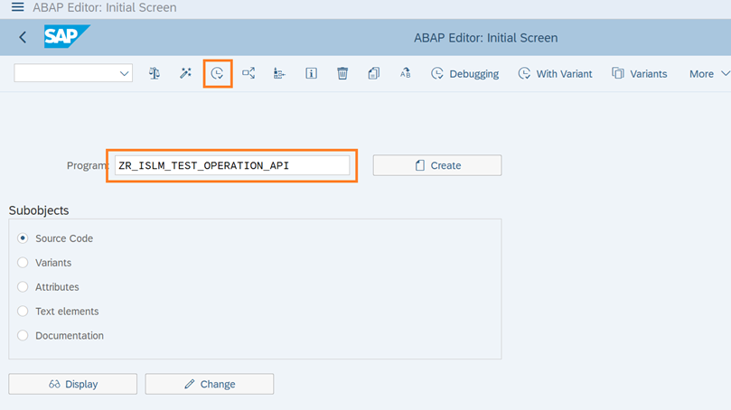
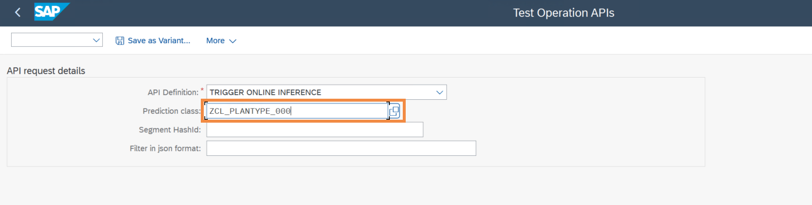
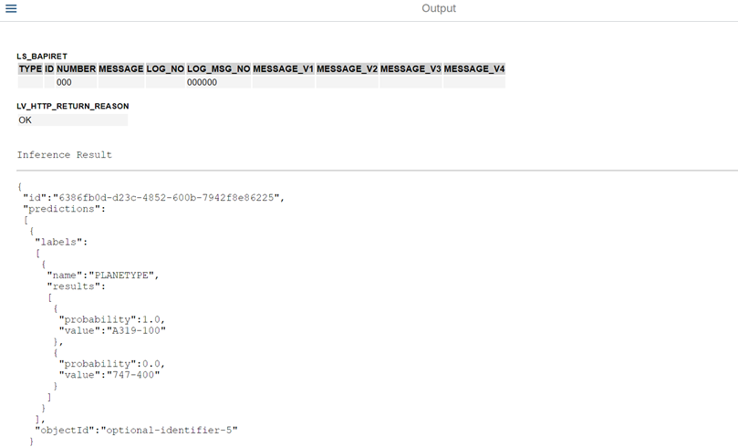

# View the inference result returned by the model in an ABAP report

In this step, you will use the ABAP GUI to view the inference result from the trained model.

1. Open transaction **/nSE38** in **S4H** system in the SAP GUI.
   

2. Enter the Report Name as `ZR_ISLM_TEST_OPERATION_API` and Click the **Execute** button.
   

3. In the API Definition, choose the option **TRIGGER_ONLINE_INFERENCE** from drop down.
   

4. Enter the prediction class associated with your Intelligent Scenario (`ZCL_PRED_PLANETYPE_###`, where ### is your attendee id). <br/> Click the **Execute** button.
   

5. Your trained model is now ready to predict the target **PLANETYPE**. To predict this target, inputs to model has to be provided. <br/> Copy the below text which contains the Inference Request with inputs in JSON format.
   - Inference Request contains the features and its value which is input for the trained model.
   - **topN**- Parameter which defines how many options will be predicted.
   - Inputs would be **FLDATE, PRICE, SEATSMAX, SEATSOCC, SEATSMAX_B, SEATSMAX_F, SEATSOCC_B, SEATSOCC_F, PAYMENTSUM, CURRENCY**.
```json
{
  "topN": 2,
  "objects": [
    {
      "objectId": "optional-identifier-5",
      "features": [
        {
          "name": "FLDATE",
          "value": ""
        },
        {
          "name": "PRICE",
          "value": "422.94"
        },
        {
          "name": "SEATSMAX",
          "value": "385"
        },
        {
          "name": "SEATSOCC",
          "value": "374"
        },
        {
          "name": "SEATSMAX_B",
          "value": "31"
        },
        {
          "name": "SEATSMAX_F",
          "value": "21"
        },
        {
          "name": "SEATSOCC_B",
          "value": "29"
        },
        {
          "name": "SEATSOCC_F",
          "value": "21"
        },
        {
          "name": "PAYMENTSUM",
          "value": ""
        },
        {
          "name": "CURRENCY",
          "value": ""
        }
      ]
    }
  ]
}
```

6. Paste the copied text in the **text editor**. Click on **tick** icon.
   

7. View the response from the trained model. <br/> In the response, you find the values that the model predicted. This includes the value that is predicted and the probability. <br/>The probability describes how certain the model is about its prediction. **If the probability is close to 1, the model is very certain**. Model predicts the PLANETYPE with two possible values(as defined in Inference request **"topN": 2** <br>
   - For predicted value of **A319-100**, the probability will be **1.0**.
   - For predicted value of **747-400**, the probability will be **0.0**. 


**Note: The predicted values and the probabilities depend heavily on the inputs, the training data as well as the training metrics**

**Well done, you just Viewed the inference result returned by the model in an ABAP report.**

🎉 **Congratulations! You have successfully completed the Exercise!**🎉
