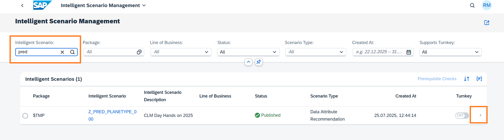
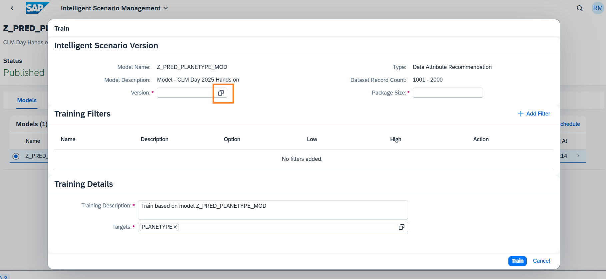
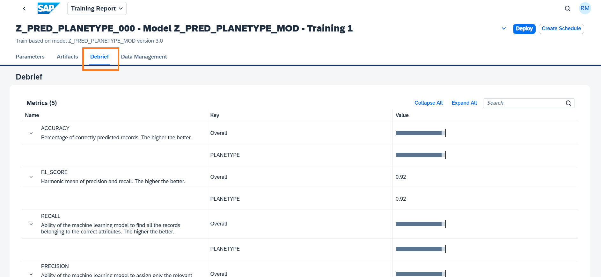
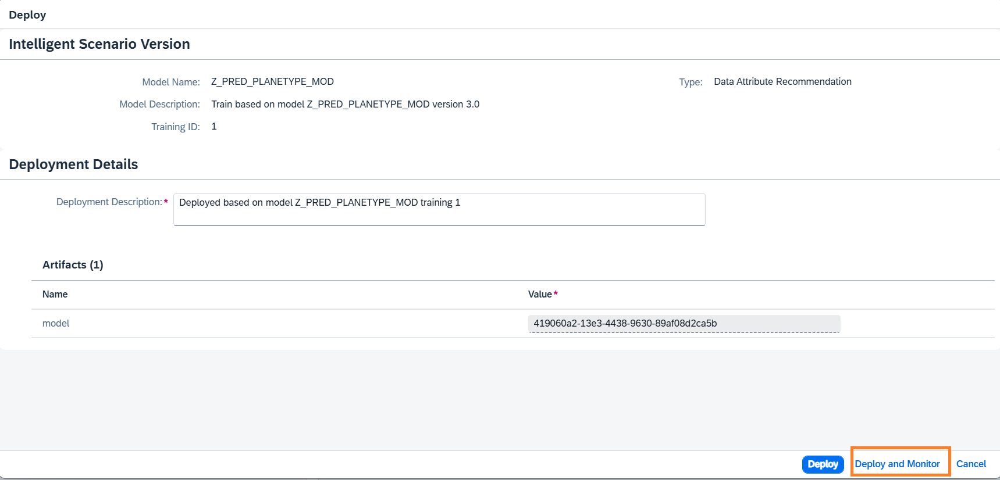
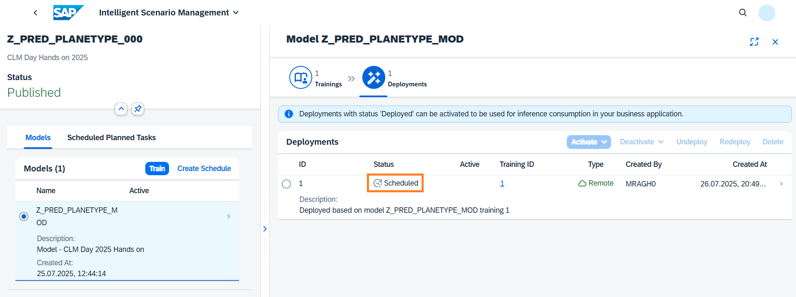
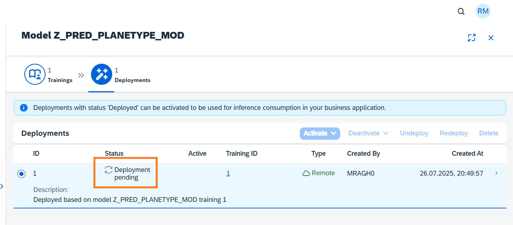

# Use Intelligent Scenario Management app to train, view model quality, deploy and activate the model

Once the Intelligent Scenario is published, the Intelligent Scenario Management app helps you to train, monitor the model quality, deploy, and activate the model for productive usage.
In this section, you will use the Intelligent Scenario Management app to perform ML operations.

1. Open the Fiori Launchpad by clicking [here](https://18.214.3.29:44301/sap/bc/ui5_ui5/ui2/ushell/shells/abap/FioriLaunchpad.html?sap-client=100&sap-language=EN#Shell-home){:target="\_blank"}. Input the username and password provided in the cheat sheet. Click the **Intelligent Scenario Management** app.
   

2. Find the scenario created by searching using the name (`Z_PRED_PLANETYPE_###`, where ### is your attendee id). Navigate to the details page by clicking the **>** icon.
   

3. Select the Model and click the **Train** button to launch the train dialog.
   

4. In train dialog, select a **Version** from the remote machine learning provider by clicking the highlighted value help.
   

5. Select the version **3.0** in the version field.
   

6. Review the information in the train dialog. Click the **Train** button.
   

7. A new Training will be created in **Scheduled** status.
   

8. Monitor the status of Training and check that the status changes to **Uploading Data**.
   

9. After data upload is complete, the status will change to **Training**.
   

10. Wait for the status of the Training to change to Completed.  **Note that training can take around 5 minutes to complete.**
    

11. Click **>** icon to view the Training Details.
    

12. View the information in header section.  Click the **Debrief** tab.
    

13. View the **Overall** and individual **target** metrics in Debrief.  **Accuracy, F1Score, Precision and Recall** are classification metrics. The higher the value, better the model.
    

14. Click the **Data Management** tab to view details of data packets which are uploaded to remote ML for training of the model.
    

15. Click the back icon to navigate back to Trainings screen.
    

16. Click the **Deploy** Button.
    

17. Verify the details in the **Deploy** dialog . Click **Deploy and Monitor** button.
    

18. A new Deployment is created in **Scheduled** status.
    

19. Monitor the status of Deployment and check the status changes to **Deployment Pending**.
    

20. Monitor the status of Deployment and check the status changes to **Deployed**.  **Note that Deployments can take approximately 10 minutes to be Deployed.**
    

21. To consume the resulting inference from this intelligent scenario the deployment must be activated. Select the Deployment and click the **Activate** button and choose **For All** option.  In the dialog Activate for All Users, choose **Activate For All**.  Validate that the Deployment has **Active for all** Indicator.
    

**Well done, you just used Intelligent Scenario Management app to train, view model quality, deploy and activate the model.**
