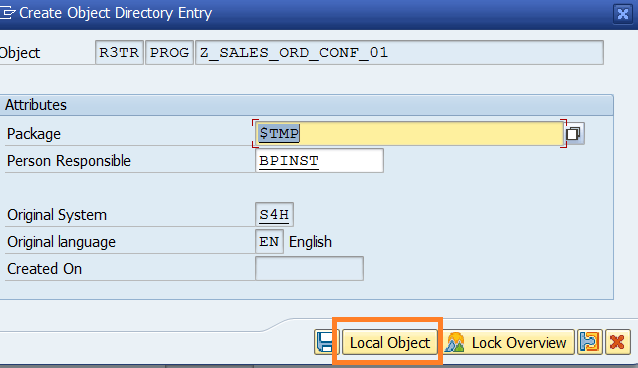

# Creating Custom Gen AI Use Cases in SAP S/4HANA

# Workshop Background and Overview
## ISLM Overview 
**Intelligent Scenario Lifecycle Management (ISLM)** is a key enabler for integrating AI into SAP S/4HANA. With its latest enhancements, ISLM now facilitates the adoption of generative AI (GenAI), providing customers and partners with a centralized framework to manage both SAP-delivered and custom AI use cases. This allows organizations to transform core business processes by integrating large language models (LLMs) seamlessly within their business applications.


Using the **ABAP AI SDK powered by Intelligent Scenario Lifecycle Management**, you can enhance your own custom ABAP-based applications with integrated generative AI features.
ISLM provides an auto enablement of generative AI-based scenarios and the connectivity management to access large language models. ISLM also provides the **Intelligent Scenario** and the **Intelligent Scenario Model**, transportable objects that contain all information to ship, instantiate, and run a solution based on generative AI functionality, including the information about the selected large language model and its version.
The ABAP AI SDK is a reuse library in an ABAP system that provides access to generative AI functionality via ISLM.

# Scope of the Workshop
Workshop aims to provide a deep dive into Intelligent Scenario Lifecycle Management (ISLM), focusing on its role as a catalyst for efficient AI (Artificial Intelligence) integration within SAP S/4HANA. The scope of this workshop includes:
### Introduction to ISLM
- Understanding the fundamentals of ISLM and its significance in the AI ecosystem.
### ISLM Integration
- Learning how ISLM standardizes the integration of intelligent scenarios within SAP S/4HANA.
### Embedding AI into applications
- Understanding how application developers leverage ISLM for creating, registering, publishing, and managing scenarios.
### Lifecycle Streamlining
- Discovering how ISLM simplifies and streamlines essential lifecycle operations, including training, deployment and activation.
**Note: Data science and AI Content development is out of the scope of this session. In this workshop, we will explore how to develop, operate and integrate Generative AI capabilities in SAP S/4HANA using ISLM.**

# ISLM Key Capabilities
- **Centralized AI Management:**  ISLM offers an end-to-end framework to manage both pre-delivered and custom AI scenarios in SAP S/4HANA. It enables organizations to integrate and operationalize AI use cases efficiently, ensuring seamless lifecycle management. 
-	**Integration with Large Language Models (LLMs):** ISLM allows customers and partners to:
  - Develop custom generative AI based use cases tailored to their business needs.
  - Integrate business applications with LLMs for enhanced automation and decision-making.
  - Enable prompt templating capabilities for effective GenAI model usage.
- **Connectivity to GenAI Hub:** ISLM enables seamless connectivity to SAP’s Generative AI Hub.
- **ISLM and ABAP AI SDK Integration:** ABAP AI SDK and Intelligent Scenario Lifecycle Management serve as integration components between business applications and large language models. Using  ABAP AI SDK powered by Intelligent Scenario Lifecycle Management (ISLM), you can easily embed generative AI capabilities into your custom ABAP based applications. ISLM and  ABAP AI SDK offer a low-code approach within ABAP stack, enabling seamless integration of generative AI models into your business applications. With the combined experience of ISLM and the ABAP AI SDK, customers can develop and deploy generative AI-driven use cases directly within their SAP S/4HANA environment.


- **Business User:** The end user who interacts with the business application and uses the predictions from machine learning for the business purpose.
- **Business Administrator:** A domain expert or analytics specialist, who can perform model trainings based on business context, evaluate model quality, and can activate a model for production usage.
- **Technical Administrator:** A system administrator who can perform the configurations of connectivity between different entities as well as maintains the technical configurations of the system.
- **ABAP Developer:** A developer who can create ABAP artifacts required for Intelligent Scenario registration.
- **Intelligent Scenario Owner:** An owner who creates, reviews, and publishes Intelligent Scenario.

# [Exercise for Hands-on] Scenario storyline:  Generate an order confirmation email based on Sales data

## 1.1	Overview: Sales Order summary
In this exercise, we are using gpt-4o-mini large language model (LLM) to generate an order confirmation email for Sales Order. As an ABAP Developer, you will use ISLM framework to create a GenAI use case in ABAP stack.

This exercise includes the following steps:
1.	Create a new Intelligent Scenario
2.	Set up the connection for Intelligent Scenario to connect to BTP based ML service. 
3.	Use Intelligent Scenario Management app to deploy and activate the model.
4.	Generate summary of Sales data using LLM. 


## 1.2	Create Intelligent Scenario
The Intelligent Scenarios app is used to create intelligent scenarios, review, and publish them, and to make them available in the Intelligent Scenario Management app.
In this step, you’ll create a new intelligent scenario to generate the order confirmation email for Sales Order using LLM model.

1. Open **SAP Logon** and logon to system. Check the username and password provided in the cheat sheet.
2. Create a Prediction Class which defines the behavior of the scenario. Prediction class has methods to specify Inference type and metadata like end point URI for LLM Model.
Open transaction **/nse24** and search for the class **ZCL_SOC_EMAIL_CONFIRMATION**

3. Click the **Copy** button.

4. Provide the unique name in the **Copy to** field. Enter a unique name starting with **ZCL**, such as **ZCL_SLS_ORD_CONF_###**, where ### is your attendee id mentioned in the cheat sheet.
And click the **tick icon**.

5. Click the **Local Object** button.

6. The class is created in **Inactive** status. Click the **Display** button.

7. View the following methods of the prediction class.
  - **IF_ISLM_INTS~GET_INFERENCE_TYPE** - Using this method, specify the inference type that supports this intelligent scenario.
  - **IF_ISLM_INTS_SBS_DAR~GET_SERVEFLOW_ENDPOINT_URI** - Using this method, specify the end point URI of the LLM Model.

8. Click the **Activate** icon.

9. Click the **tick** icon.

10. Open the Fiori Launchpad by clicking [here](https://44.207.24.229:44301/sap/bc/ui5_ui5/ui2/ushell/shells/abap/FioriLaunchpad.html?sap-client=100&sap-language=EN#Shell-home){:target="_blank"}.
Input the username and password provided in the cheat sheet. Click on My Home section and choose the **Intelligent Scenarios** app.

11. Click the **Create** button and choose **Side-by Side**.

12. Provide the required information in the screen:
  - **Intelligent Scenario Name**: Enter a unique name starting with Z, such as **Z_SLS_ORD_CONF_###**, where ### is your attendee id mentioned in the cheat sheet.
  - **Intelligent Scenario Description**: Generate sales order confirmation email
  - **Intelligent Scenario Type**: Generative AI
 

13. Select **Prediction Class** from value help.


14. Select the **prediction class** created by you in the previous section.


15. Click the **Add Model** button.


16. The Add Generative AI Model screen will pop up. Enter the below details:
  - Name: **Z_SLS_ORD_CONF_MDL**
  - Description: **LLM Model for generating SO email**
  - Executable ID: **azure-openai**
  - Large Language Model Name: **gpt-4o-mini**


17. Click the **Add** button.


18. Click the **Add** prompt templates button.


19. In the Add Prompt Template dialog, enter the below details:
  - Name: **SYSTEM_PROMPT**
  - Description: **Provide context to gpt-4o-mini model**


20. Enter the **Prompt** text:
```
You are a sales executive who is responsible for reaching out to customers for confirming or declining their orders via email.
For the given sales order, evaluate the following:
1. Size of the delivery vehicle based on the number of items.
2. The distance between the source and destination location of delivery in kilometers.
3. The category of items which are ordered.

Write an email in the following format:
- The subject of email should be of format <Confirmation on order number: {order_number} placed on {booking_date}>
- The body of email should be of format: "Sales order contains <Category> to be delivered to <Location>. The order will be delivered via a <size> vehicle.
IF <distance between source address and delivery address> > 100 kms THEN include a message about potential delivery delays ELSE congratulate on being eligible for one day delivery
```


21. Click the **Save** button.


22. Click the **Add** prompt templates button.


23. In the Add Prompt Template dialog, enter the below details:
  - Name: **USER_PROMPT**
  - Description: **Provide sales order item data for generating the order confirmation email**


24. Enter the **Prompt** text:
```
Build a confirmation mail for a sales order containing {ISLM_Items}. The source address is {ISLM_Source} and the delivery address is {ISLM_Destination}.
```


25. Click the **Save** button.


26. The added prompt should be visible in the Prompt Templates table. Click the **Save Draft** button.


27. Navigate back to Intelligent Scenario by clicking the **back** button.


28. Scenario is now ready to be published. Click on **Publish** button. You will receive a message that Intelligent Scenario is published.


29. Search the Intelligent Scenario created by you by entering the **Intelligent Scenario name** and **Status = Published**.


Well done, you just created your first Side-by-side Intelligent Scenario.


## 1.3	Connection setup
Once the Intelligent Scenario is published, we need to maintain the connection for an intelligent scenario in SAP S/4 HANA with the Generative AI Hub service in BTP.
Your service key is indicated in the cheat sheet that you received.

1. Logon to **SAP GUI**. Check the username and password provided in the cheat sheet.
2. Call up the transaction **ISLM_CONN_MAP** and Click the **Create Connection** icon.

3. Input the **Intelligent Scenario Name** and click on **Next** button.


4. Enter the **service key** from remote machine learning provider which is mentioned in the cheat sheet. And click the **Next** button.

5. The **RFC Destination** and **OAuth 2.0 Client Configuration** will be generated using the service key.
 

6. Perform **Connection Check** to know the health of ML provider.


7. Ensure that the Connection Status changes to **Ready**. Click the **Save** button.


8. A new entry will be added to the table.


Well done, you just **Set up the connection for Intelligent Scenario** to connect to BTP based Generative AI Hub service.


## 1.4	Operate the Intelligent Scenario
Once the Intelligent Scenario is published, the Intelligent Scenario Management app helps you to deploy and activate the model for productive usage.
In this section, you will use the **Intelligent Scenario Management app** to perform operations on your Intelligent Scenario.

1. Open the Fiori Launchpad by clicking [here](https://44.207.24.229:44301/sap/bc/ui5_ui5/ui2/ushell/shells/abap/FioriLaunchpad.html?sap-client=100&sap-language=EN#Shell-home){:target="_blank"}.
Input the username and password provided in the cheat sheet. Click on My Home section and choose the **Intelligent Scenario Management** app.

2. Search the **Gen AI** scenario created by you and navigate to the details page by clicking the **>** icon.

3. Navigate to details page by clicking the **>** icon

4. Click the **Deploy** Button.

5. Click the **Deploy and Monitor** Button.

6. A new Deployment will be created in **Deployment Pending** status.

7. Monitor the status of Deployment and check the status changes to Deployed. 
**Note**: Deployments can take approximately 10 minutes to be Deployed.

8. Activate the deployment to run inference. Select the Deployment and click on **Activate** button and choose **For All** option.

9. In the dialog Activate for All Users, choose **Activate For All** button.


Well done, you just Used Intelligent Scenario Management app to deploy and activate the llm model.


## 1.5	Generate Sales Order Confirmation email. 
In this step, you will use the ABAP GUI to view the email generated using LLM model.

1. Logon to backend system and execute the transaction code **/nSE38**.


2. Input the Report Name as **Z_SALES_ORD_CONF_###**, where ### is your attendee id mentioned in the cheat sheet. Click the **Create** button.


3. In the dialog input the below details:
  - Title: **Generate confirmation email for sales order**
  - Select the **Type** as **Executable program**.
  - Change the **Status** to **Test program**


4. Click the **Save** button.


5. Click the **Local Object** button in the **Create Object Directory Entry** dialog.


6. In the editor, paste the below code. Change the intelligent scenario name in the report to the scenario that you have created, where ### is your attendee id.
```
DATA lv_scenario_name TYPE islm_de_sbs_is_name VALUE 'Z_SLS_ORD_CONF_###'.

TRY.
**  ISLM and ABAP GenAI SDK offer a unified solution for both business and technical use cases,
**  facilitating prompt execution within the context of business applications.

    " Create an instance of the ABAP GenAI SDK based on an ISLM Scenario
    DATA(lo_sdk_islm_api) = cl_aic_islm_compl_api_factory=>get( )->create_instance( islm_scenario = lv_scenario_name ).
    DATA(lo_message_container) = lo_sdk_islm_api->create_message_container( ).

    " Add a system prompt based on an ISLM prompt template without parameters
    DATA(lo_system_prompt_template) = cl_aic_islm_prompt_tpl_factory=>get( )->create_instance( islm_scenario = lv_scenario_name
                                                                                               template_id   = 'SYSTEM_PROMPT' ).
    lo_message_container->set_system_role( lo_system_prompt_template->get_prompt( ) ).

    " Add a user prompt based on an ISLM prompt template with parameters
    DATA(lo_user_prompt_template) = cl_aic_islm_prompt_tpl_factory=>get( )->create_instance( islm_scenario = lv_scenario_name
                                                                                             template_id   = 'USER_PROMPT' ).
    DATA parameters TYPE if_aic_prompt_template=>param_values.
    parameters = VALUE #( ( name = 'ISLM_Items'       value = '200 Pencils,#80 Monitors,#2500 Notepads,#100 Office chairs,#200 Coffee Mugs,#50 Black Markers,#80 Laptops,#50 Green Markers')
                          ( name = 'ISLM_Source'      value = 'Chennai' )
                          ( name = 'ISLM_Destination' value = 'Mumbai') ).
    lo_message_container->add_user_message( lo_user_prompt_template->get_prompt( parameters ) ).

    " Set LLM parameters
    DATA(lo_parameter_setter) = lo_sdk_islm_api->get_parameter_setter( ).
    lo_parameter_setter->set_temperature( '0.7' ).
    lo_parameter_setter->set_maximum_tokens( 800 ).


    " Send request to LLM and receive result
    DATA(lo_response) = lo_sdk_islm_api->execute_for_messages( messages = lo_message_container ).
    DATA(lv_response) = lo_response->get_completion( ).
    DATA(lv_status) = 'S'.

  CATCH cx_aic_api_factory INTO DATA(lx_factory).
    lv_response = lx_factory->get_text( ).
    lv_status = 'E'.
  CATCH cx_aic_completion_api INTO DATA(lx_completion).
    lv_response = lx_completion->get_text( ).
    lv_status = 'E'.
  CATCH cx_aic_prompt_template INTO DATA(lx_prompt_template).
    lv_response = lx_prompt_template->get_text( ).
    lv_status = 'E'.
ENDTRY.

" Display the sales report generated by gpt-4o-mini model
cl_demo_output=>display_text( text = lv_response ).
```

7. **Activate** the report.


8. **Execute** the report.


9. Order confirmation email for sales order generated by LLM model will be displayed.


Well done, you have successfully queried the **gpt-4o-mini model** to generate the confirmation email for sales order.
