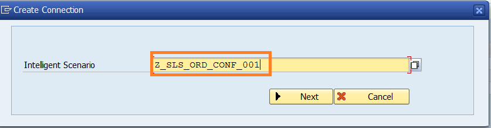
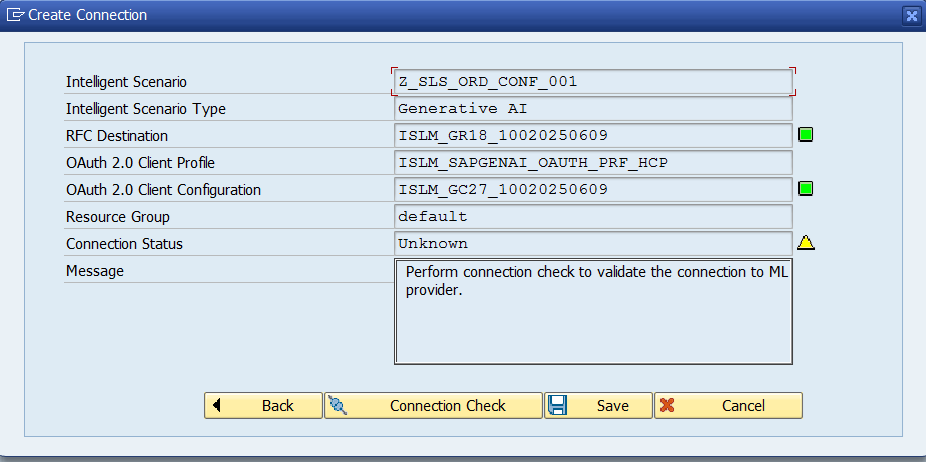
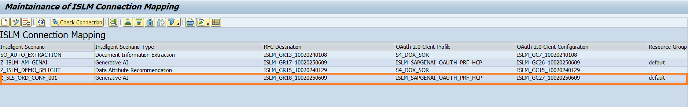

# Connection setup

Once the Intelligent Scenario is published, we need to maintain the connection for an intelligent scenario in SAP S/4 HANA with the Generative AI Hub service in BTP.
Your service key is indicated in the cheat sheet that you received.

1. Logon to **S4H** system in **SAP GUI**. Check the username and password provided in the cheat sheet.
2. Call up the transaction `/n ISLM_CONN_MAP` and Click the **Create Connection** icon.
   
3. Input the **Intelligent Scenario Name** and click on **Next** button.
   

4. Enter the **service key** from remote machine learning provider which is mentioned in the cheat sheet. And click the **Next** button.
   
5. The **RFC Destination** and **OAuth 2.0 Client Configuration** will be generated using the service key.
   

6. Perform **Connection Check** to know the health of ML provider.
   

7. Ensure that the Connection Status changes to **Ready**. Click the **Save** button.
   

8. A new entry will be added to the table.
   

Well done, you just **Set up the connection for Intelligent Scenario** to connect to BTP based Generative AI Hub service.
