# Create Intelligent Scenario

The Intelligent Scenarios app is used to create intelligent scenarios, review, and publish them, and to make them available in the Intelligent Scenario Management app.
In this step, you’ll create a new intelligent scenario to generate the order confirmation email for Sales Order using LLM model.

1. Open the Fiori Launchpad by clicking [here](https://18.214.3.29:44301/sap/bc/ui5_ui5/ui2/ushell/shells/abap/FioriLaunchpad.html?sap-client=100&sap-language=EN#Shell-home).<br/>Click on **Intelligent Scenario Management** section and choose the **Intelligent Scenarios** app. 
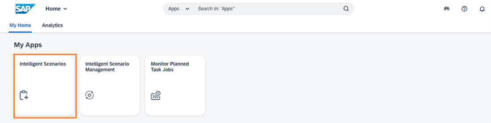
2. Click the **Create** button and choose **Side-by Side**.
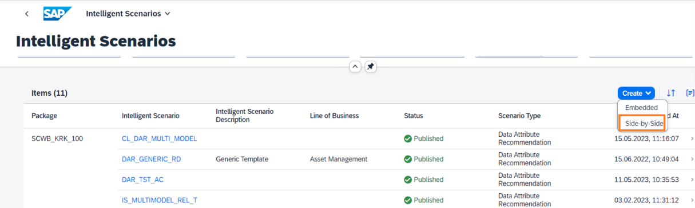
3. Provide the required information on the screen:
    - **Intelligent Scenario Name**: Enter a unique name starting with Z, such as `Z_SLS_ORD_CONF_###`, where ### is your attendee id mentioned in the cheat sheet.
    - **Intelligent Scenario Description**: `Generate sales order confirmation email`
    - **Intelligent Scenario Type**: `Generative AI`
      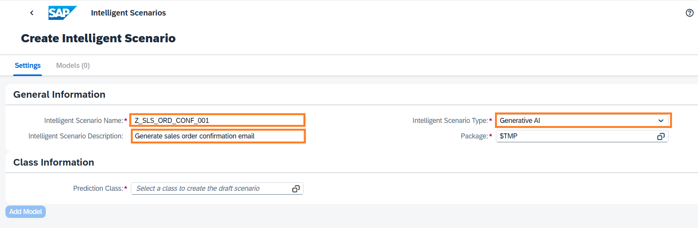
4. Select the **Usage Type** as **Stateless - With Embeddings**.<br> The usage type provides connectivity to GenAI Hub. For Stateless - With Embeddings usage type, the information or data from previous interactions with LLM is not retained. Each interaction is treated as a new request, ensuring a fresh context for every interaction.

5. Click the **Add Model** button.
    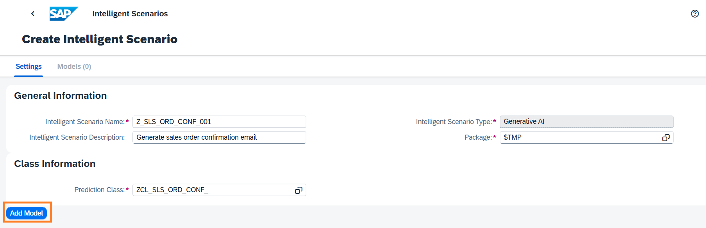

6. The **Add Generative AI Model** screen will pop up. Enter the below details:
    - Name: `Z_SLS_ORD_CONF_MDL`
    - Description: `LLM Model for generating SO email`
    - Executable ID: `azure-openai`
    - Large Language Model Name: `gpt-5o-mini`
    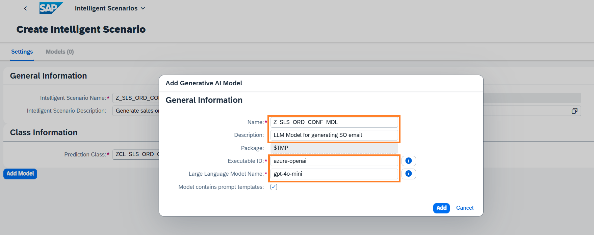

7. Click the **Add** button.
    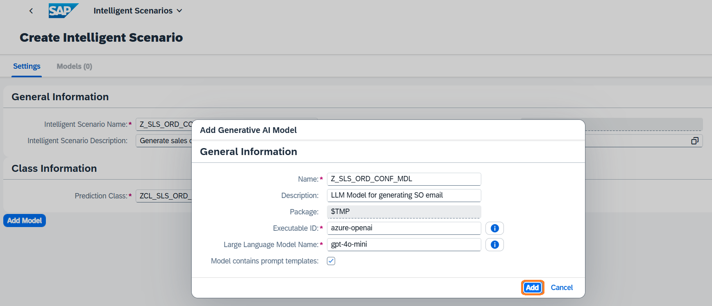

8. Click the **Add** prompt templates button.
    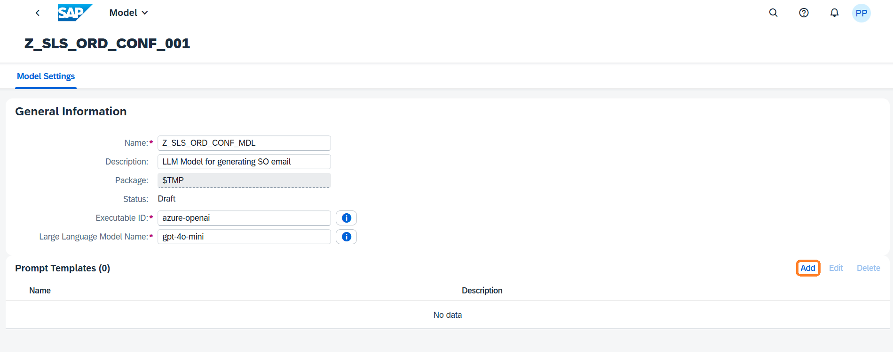

9. In the A**dd Prompt Template** dialog, enter the below details:
    - Name: `SYSTEM_PROMPT`
    - Description: `Provide context to gpt-5o-mini model`
    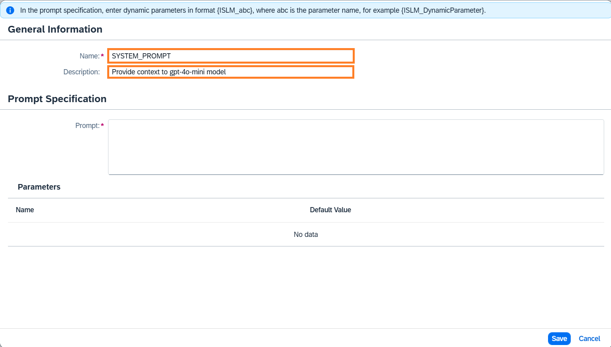

10. Enter the below **Prompt** text:
```
You are a sales executive who is responsible for reaching out to customers for confirming or declining their orders via email.
For the given sales order, evaluate the following:
1. Size of the delivery vehicle based on the number of items.
2. The distance between the source and destination location of delivery in kilometers.
3. The category of items which are ordered.

Write an email in the following format:
- The subject of email should be of format <Confirmation on order number: {order_number} placed on {booking_date}>
- The body of email should be of format: "Sales order contains <Category> to be delivered to <Location>. The order will be delivered via a <size> vehicle.
IF <distance between source address and delivery address> > 100 kms THEN include a message about potential delivery delays ELSE congratulate on being eligible for one day delivery
```
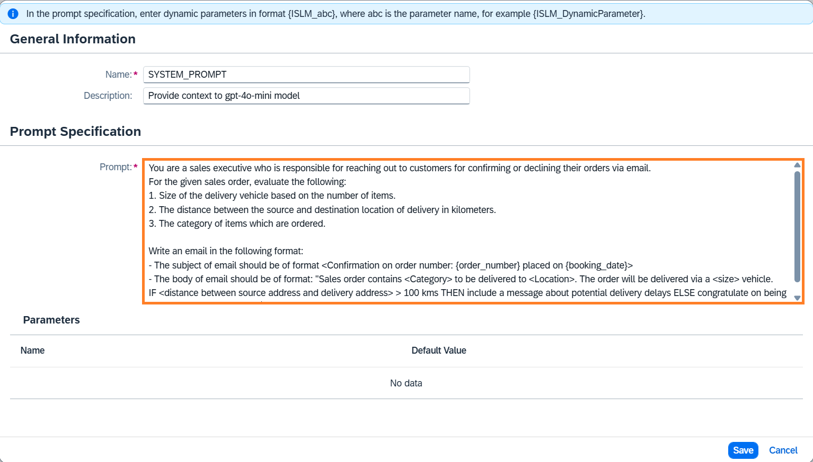

11. Click the **Save** button.
    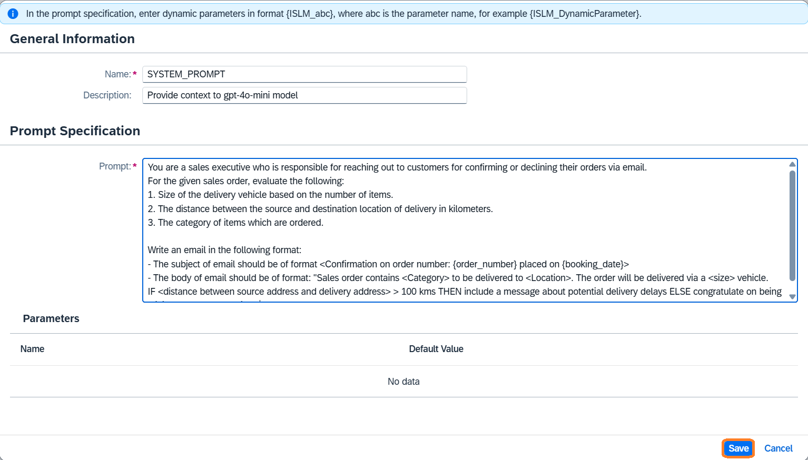

12. Click the **Add** prompt templates button.
    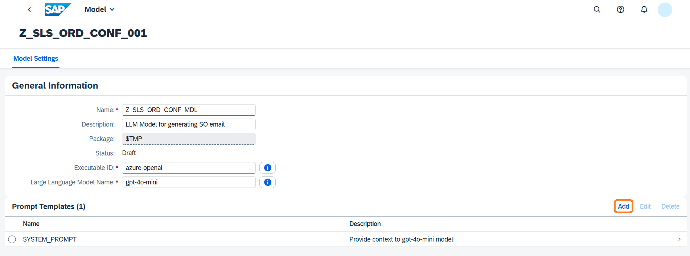

13. In the **Add Prompt Template** dialog, enter the below details:
    - Name: `USER_PROMPT`
    - Description: `Provide sales order item data for generating the order confirmation email`
    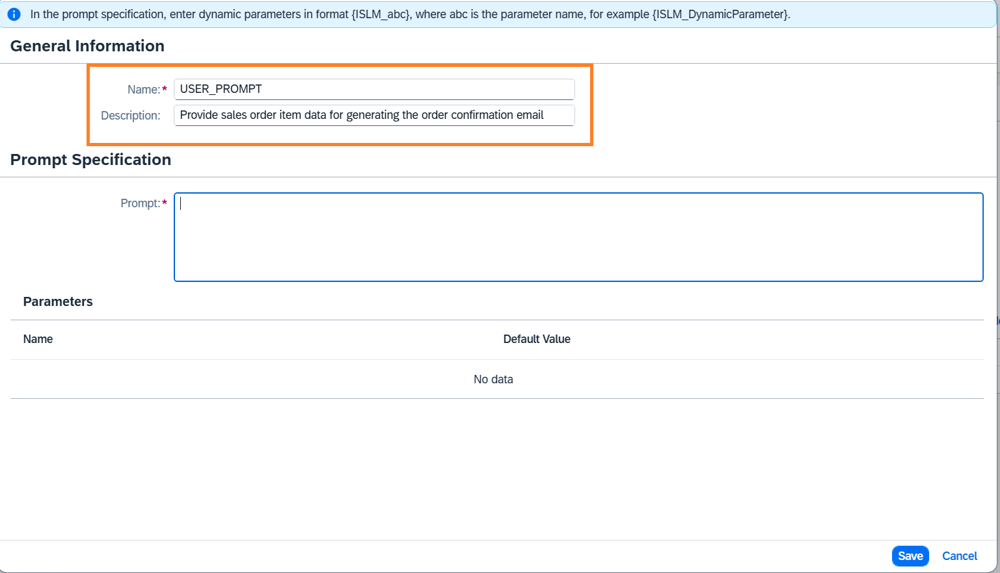

14. Enter the below **Prompt** text:
```
Build a confirmation mail for a sales order containing {ISLM_Items}. The source address is {ISLM_Source} and the delivery address is {ISLM_Destination}.
```
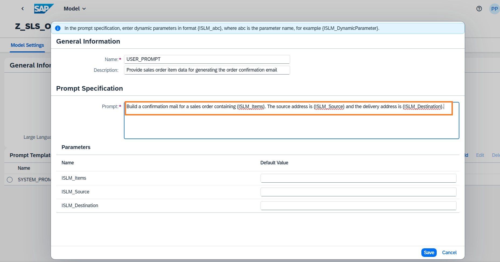

15. Click the **Save** button.
    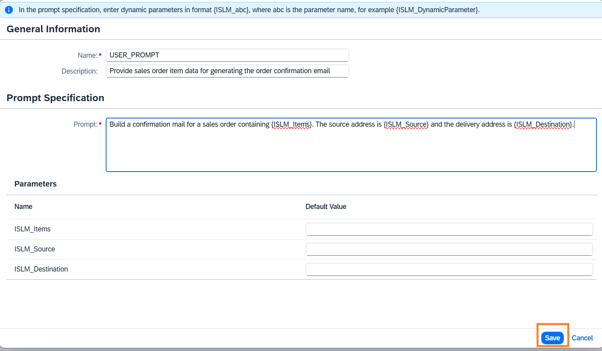

16. The added prompt should be visible in the Prompt Templates table. Click the **Save Draft** button.
    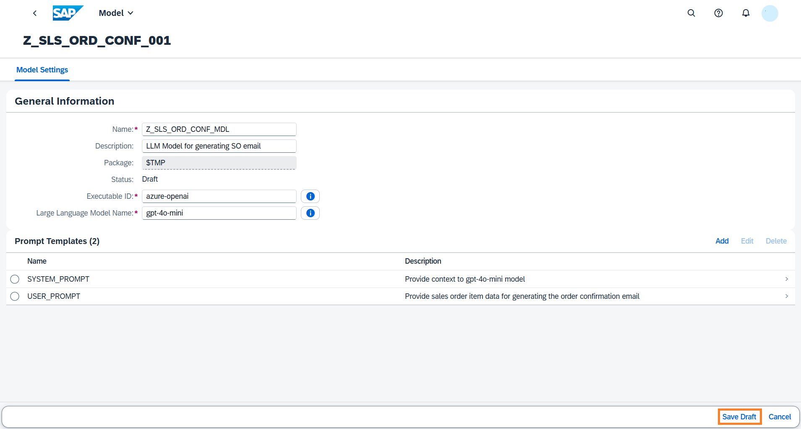

17. Navigate back to Intelligent Scenario by clicking the **back** button.
    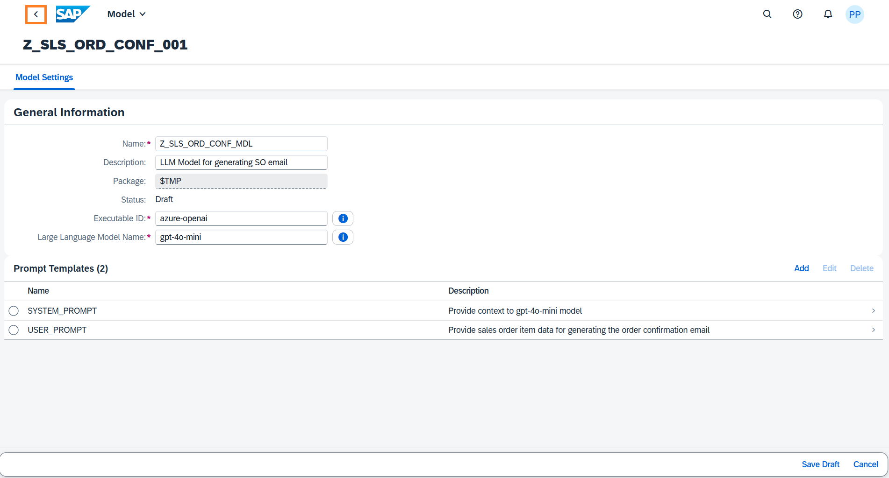

18. Scenario is now ready to be published. Click on **Publish** button. You will receive a message that Intelligent Scenario is published.
    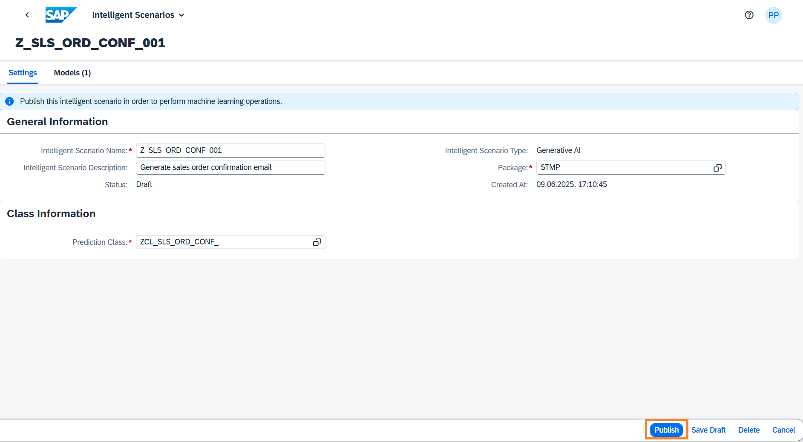

19. Search the Intelligent Scenario created by you by entering the **Intelligent Scenario name** and **Status = Published**.
    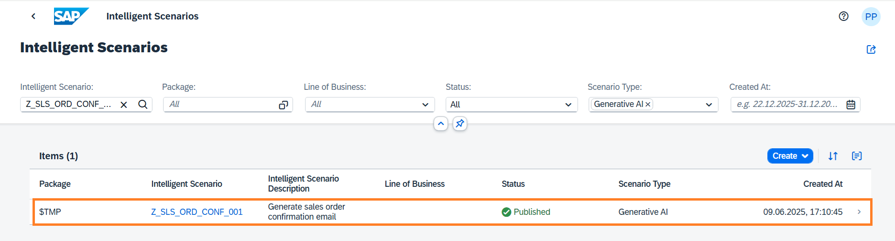

Well done, you just created your first Side-by-side Intelligent Scenario.
