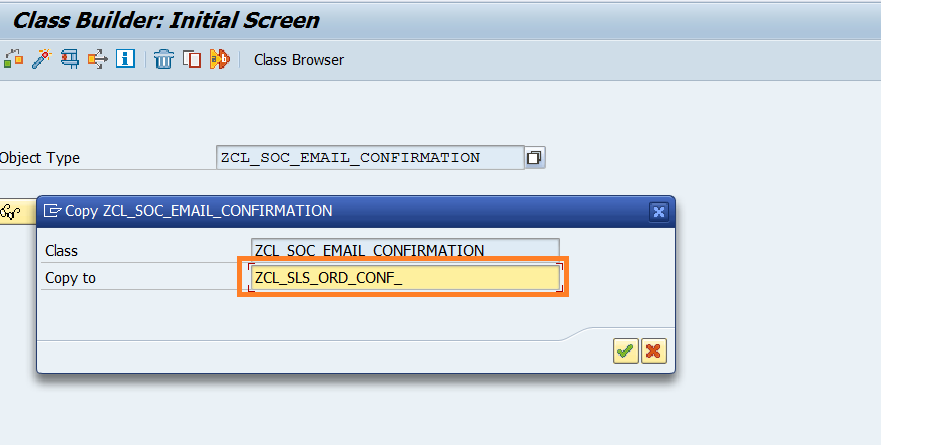
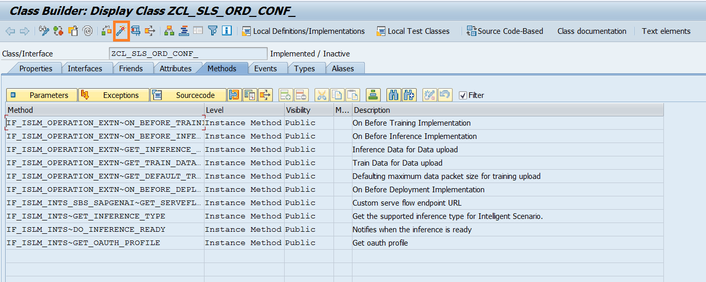
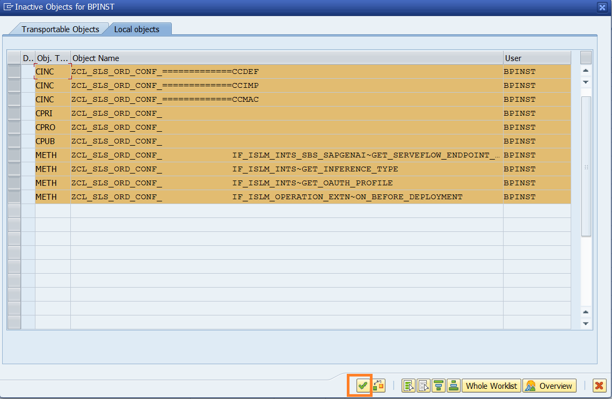
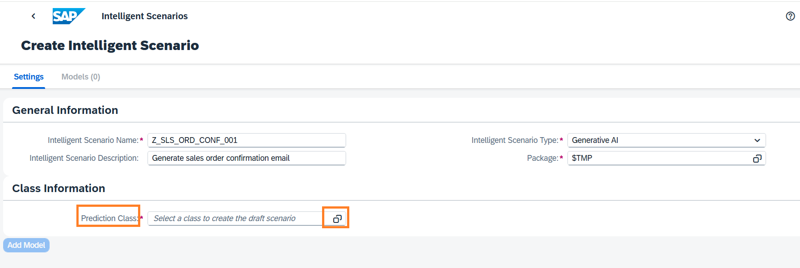
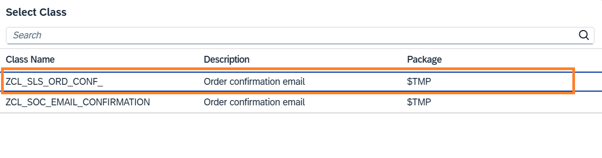
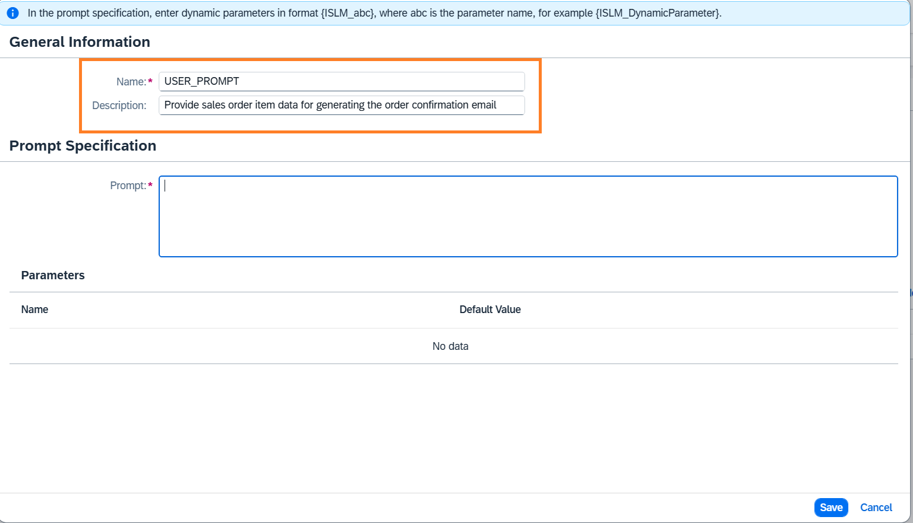
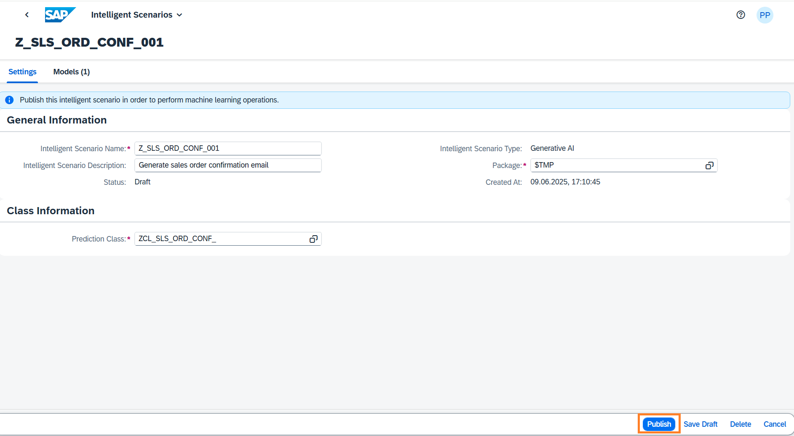

# Create Intelligent Scenario

The Intelligent Scenarios app is used to create intelligent scenarios, review, and publish them, and to make them available in the Intelligent Scenario Management app.
In this step, you’ll create a new intelligent scenario to generate the order confirmation email for Sales Order using LLM model.

1. Open **SAP Logon** and logon to **S4H** system.
2. Create a Prediction Class which defines the behavior of the scenario. Prediction class has methods to specify Inference type and metadata like end point URI for LLM Model. <br/>Open transaction `/nse24` and search for the class `ZCL_SOC_EMAIL_CONFIRMATION`

3. Click the **Copy** button.


4. Provide the unique name in the **Copy to** field. Enter a unique name starting with `ZCL`, such as `ZCL_SLS_ORD_CONF_###`, where ### is your attendee id mentioned in the cheat sheet. And click the **tick icon**.

5. Click the **Local Object** button.

6. The class is created in **Inactive** status. Click the **Display** button.

7. View the following methods of the prediction class.
   - **IF_ISLM_INTS~GET_INFERENCE_TYPE**: Using this method, specify the inference type that supports this intelligent scenario.
   - **IF_ISLM_INTS_SBS_DAR~GET_SERVEFLOW_ENDPOINT_URI**: Using this method, specify the end point URI of the LLM Model.

8. Click the **Activate** icon.

9. Click the **tick** icon.

10. Open the Fiori Launchpad by clicking [here](https://18.214.3.29:44301/sap/bc/ui5_ui5/ui2/ushell/shells/abap/FioriLaunchpad.html?sap-client=100&sap-language=EN#Shell-home){:target="\_blank"}.<br/>Click on **Intelligent Scenario Management** section and choose the **Intelligent Scenarios** app. 

11. Click the **Create** button and choose **Side-by Side**.

12. Provide the required information in the screen:
    - **Intelligent Scenario Name**: Enter a unique name starting with Z, such as `Z_SLS_ORD_CONF_###`, where ### is your attendee id mentioned in the cheat sheet.
    - **Intelligent Scenario Description**: `Generate sales order confirmation email`
    - **Intelligent Scenario Type**: `Generative AI`
      

13. Select **Prediction Class** from value help.
    

14. Select the **prediction class** created by you in the previous section.
    

15. Click the **Add Model** button.
    

16. The Add Generative AI Model screen will pop up. Enter the below details:
    - Name: `Z_SLS_ORD_CONF_MDL`
    - Description: `LLM Model for generating SO email`
    - Executable ID: `azure-openai`
    - Large Language Model Name: `gpt-4o-mini`
    

17. Click the **Add** button.
    

18. Click the **Add** prompt templates button.
    

19. In the Add Prompt Template dialog, enter the below details:
    - Name: `SYSTEM_PROMPT`
    - Description: `Provide context to gpt-4o-mini model`
    

20. Enter the **Prompt** text:
```
You are a sales executive who is responsible for reaching out to customers for confirming or declining their orders via email.
For the given sales order, evaluate the following:
1. Size of the delivery vehicle based on the number of items.
2. The distance between the source and destination location of delivery in kilometers.
3. The category of items which are ordered.

Write an email in the following format:
- The subject of email should be of format <Confirmation on order number: {order_number} placed on {booking_date}>
- The body of email should be of format: "Sales order contains <Category> to be delivered to <Location>. The order will be delivered via a <size> vehicle.
IF <distance between source address and delivery address> > 100 kms THEN include a message about potential delivery delays ELSE congratulate on being eligible for one day delivery
```


21. Click the **Save** button.
    

22. Click the **Add** prompt templates button.
    

23. In the Add Prompt Template dialog, enter the below details:
    - Name: `USER_PROMPT`
    - Description: `Provide sales order item data for generating the order confirmation email`
    

24. Enter the **Prompt** text:
```
Build a confirmation mail for a sales order containing {ISLM_Items}. The source address is {ISLM_Source} and the delivery address is {ISLM_Destination}.
```


25. Click the **Save** button.
    

26. The added prompt should be visible in the Prompt Templates table. Click the **Save Draft** button.
    

27. Navigate back to Intelligent Scenario by clicking the **back** button.
    

28. Scenario is now ready to be published. Click on **Publish** button. You will receive a message that Intelligent Scenario is published.
    

29. Search the Intelligent Scenario created by you by entering the **Intelligent Scenario name** and **Status = Published**.
    

Well done, you just created your first Side-by-side Intelligent Scenario.
