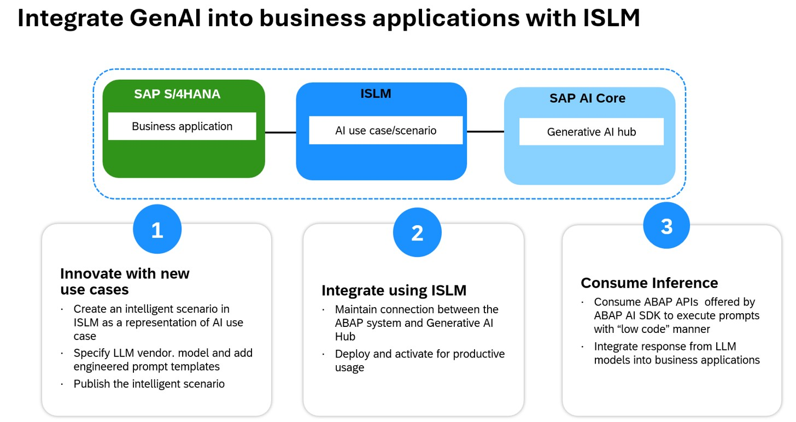

# Exercise Overview: Generate an order confirmation email based on Sales data

In this exercise, we are using **gpt-5-mini** large language model (LLM) to generate an order confirmation email for Sales Order. As an ABAP Developer, you will use ISLM framework to create a GenAI use case in ABAP stack.

This exercise includes the following steps:

1.  Create a new Intelligent Scenario
2.  Use Intelligent Scenario Management app to deploy and activate the model.
3.  Generate summary of Sales data using LLM.

