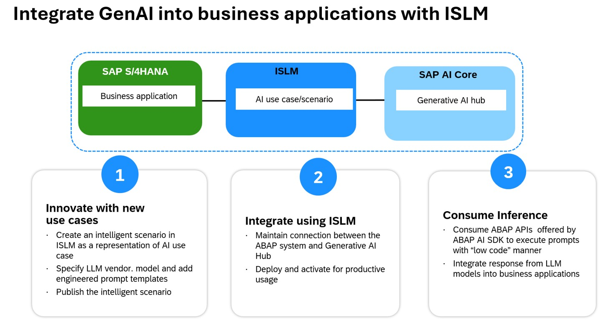

# Exercise Overview: Generate an order confirmation email based on Sales data

In this exercise, we are using **gpt-4o-mini** large language model (LLM) to generate an order confirmation email for Sales Order. As an ABAP Developer, you will use ISLM framework to create a GenAI use case in ABAP stack.

This exercise includes the following steps: 1. Create a new Intelligent Scenario 2. Set up the connection for Intelligent Scenario to connect to BTP based ML service. 3. Use Intelligent Scenario Management app to deploy and activate the model. 4. Generate summary of Sales data using LLM.

