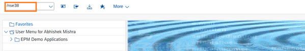
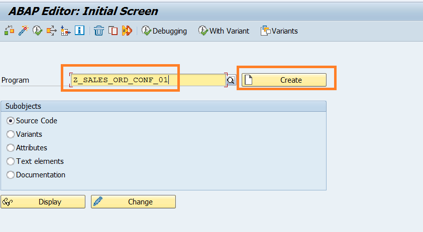
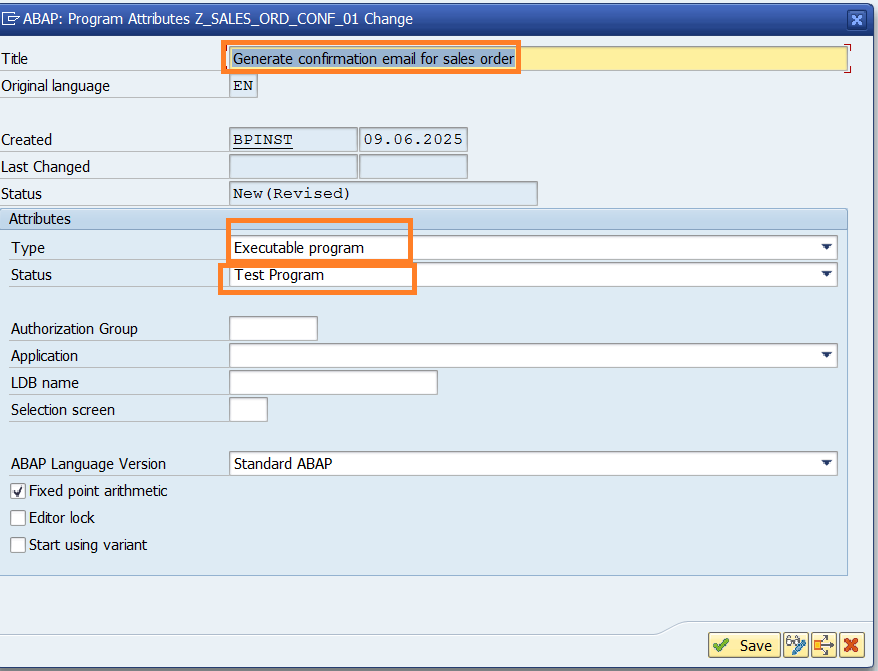
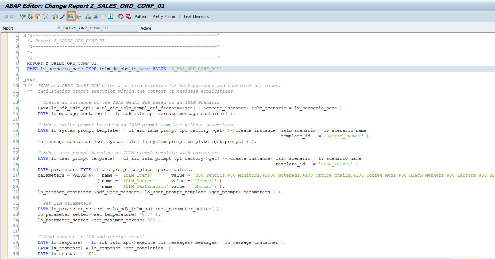

# Generate Sales Order Confirmation email

In this step, you will use the ABAP GUI to view the email generated using LLM model.

1. Logon to `S4H` system in SAP GUI and execute the transaction code `/nSE38`.
   

2. Input the Report Name as `Z_SALES_ORD_CONF_###`, where ### is your attendee id mentioned in the cheat sheet. Click the **Create** button.
   

3. In the dialog input the below details: - Title: `Generate confirmation email for sales order` - Select the **Type** as `Executable program`. - Change the **Status** to `Test program`.
   

4. Click the **Save** button.
   

5. Click the **Local Object** button in the **Create Object Directory Entry** dialog.
   

6. In the editor, paste the below code. Change the intelligent scenario name in the report to the scenario that you have created, where ### is your attendee id.

```
DATA lv_scenario_name TYPE islm_de_sbs_is_name VALUE 'Z_SLS_ORD_CONF_###'.

TRY.
**  ISLM and ABAP GenAI SDK offer a unified solution for both business and technical use cases,
**  facilitating prompt execution within the context of business applications.

    " Create an instance of the ABAP GenAI SDK based on an ISLM Scenario
    DATA(lo_sdk_islm_api) = cl_aic_islm_compl_api_factory=>get( )->create_instance( islm_scenario = lv_scenario_name ).
    DATA(lo_message_container) = lo_sdk_islm_api->create_message_container( ).

    " Add a system prompt based on an ISLM prompt template without parameters
    DATA(lo_system_prompt_template) = cl_aic_islm_prompt_tpl_factory=>get( )->create_instance( islm_scenario = lv_scenario_name
                                                                                               template_id   = 'SYSTEM_PROMPT' ).
    lo_message_container->set_system_role( lo_system_prompt_template->get_prompt( ) ).

    " Add a user prompt based on an ISLM prompt template with parameters
    DATA(lo_user_prompt_template) = cl_aic_islm_prompt_tpl_factory=>get( )->create_instance( islm_scenario = lv_scenario_name
                                                                                             template_id   = 'USER_PROMPT' ).
    DATA parameters TYPE if_aic_prompt_template=>param_values.
    parameters = VALUE #( ( name = 'ISLM_Items'       value = '200 Pencils,#80 Monitors,#2500 Notepads,#100 Office chairs,#200 Coffee Mugs,#50 Black Markers,#80 Laptops,#50 Green Markers')
                          ( name = 'ISLM_Source'      value = 'Chennai' )
                          ( name = 'ISLM_Destination' value = 'Mumbai') ).
    lo_message_container->add_user_message( lo_user_prompt_template->get_prompt( parameters ) ).

    " Set LLM parameters
    DATA(lo_parameter_setter) = lo_sdk_islm_api->get_parameter_setter( ).
    lo_parameter_setter->set_temperature( '0.7' ).
    lo_parameter_setter->set_maximum_tokens( 800 ).


    " Send request to LLM and receive result
    DATA(lo_response) = lo_sdk_islm_api->execute_for_messages( messages = lo_message_container ).
    DATA(lv_response) = lo_response->get_completion( ).
    DATA(lv_status) = 'S'.

  CATCH cx_aic_api_factory INTO DATA(lx_factory).
    lv_response = lx_factory->get_text( ).
    lv_status = 'E'.
  CATCH cx_aic_completion_api INTO DATA(lx_completion).
    lv_response = lx_completion->get_text( ).
    lv_status = 'E'.
  CATCH cx_aic_prompt_template INTO DATA(lx_prompt_template).
    lv_response = lx_prompt_template->get_text( ).
    lv_status = 'E'.
ENDTRY.

" Display the sales report generated by gpt-4o-mini model
cl_demo_output=>display_text( text = lv_response ).
```

7. **Activate** the report.
   

8. **Execute** the report.
   

9. Order confirmation email for sales order generated by LLM model will be displayed.
   

Well done, you have successfully queried the **gpt-4o-mini model** to generate the confirmation email for sales order.
