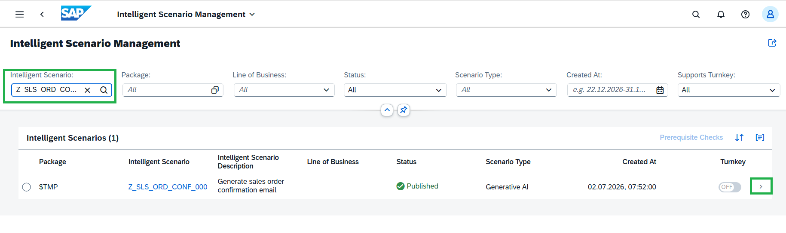
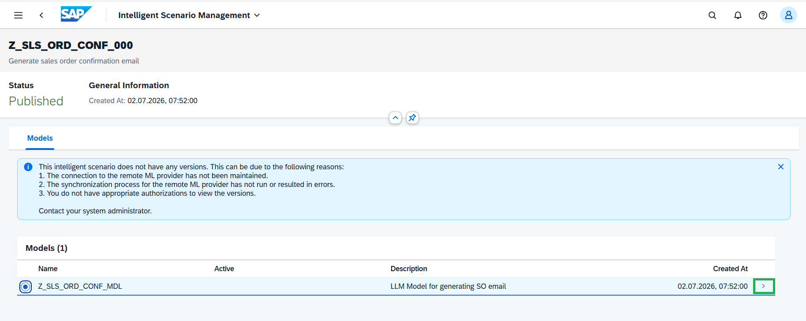
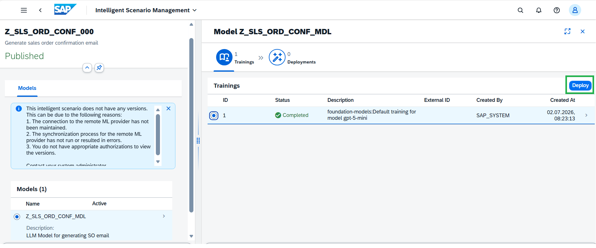
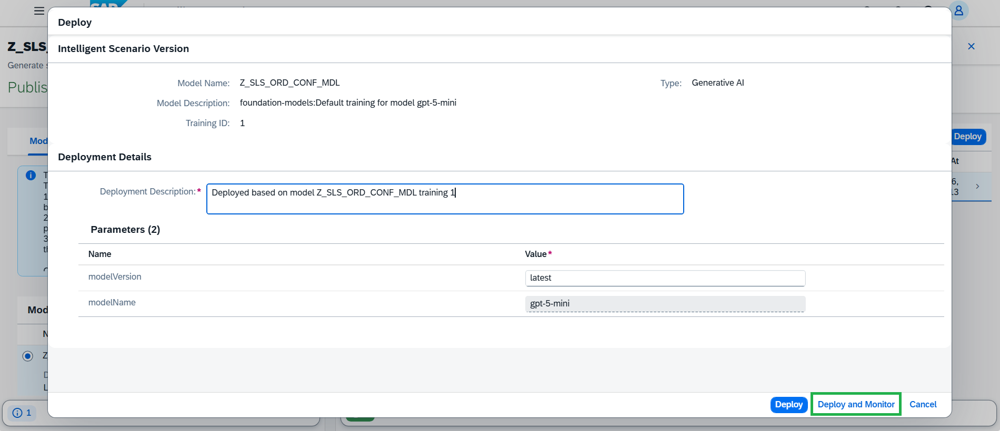
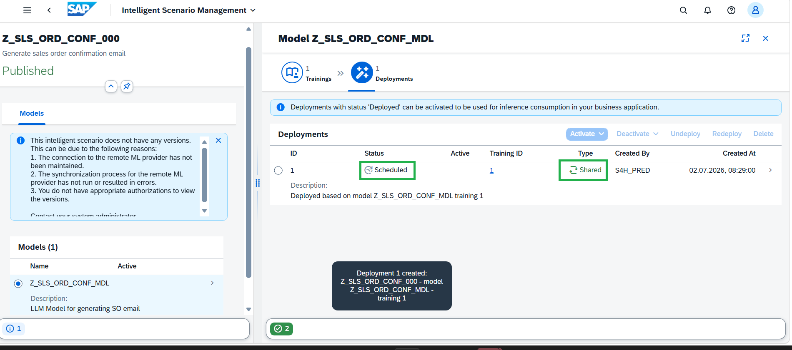
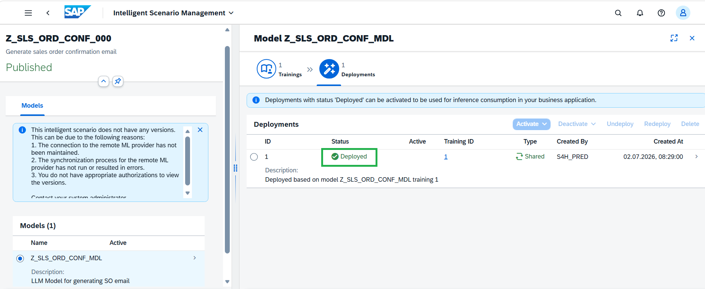
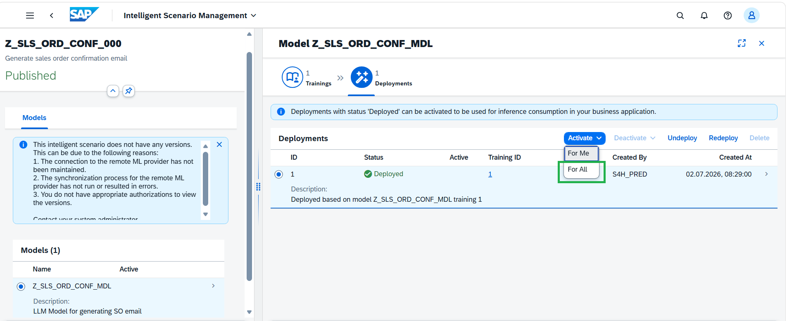
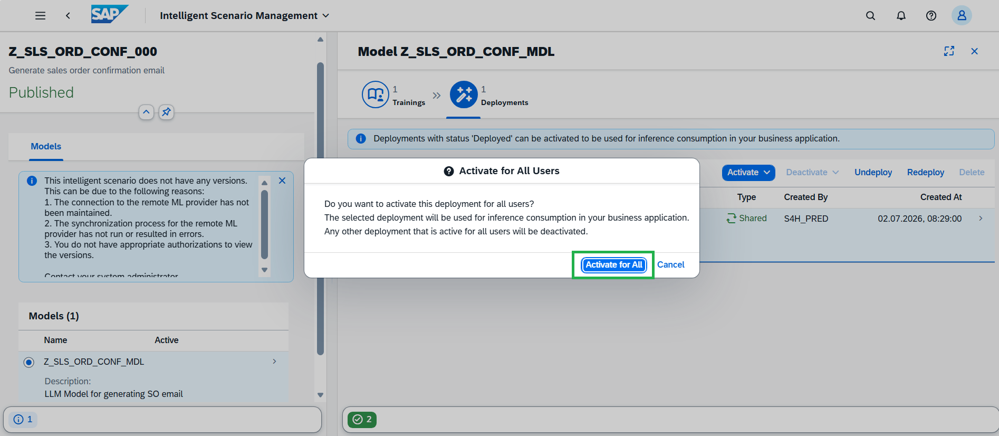

# Operate the Intelligent Scenario

Once the Intelligent Scenario is published, the Intelligent Scenario Management app helps you to deploy and activate the model for productive usage.
In this section, you will use the **Intelligent Scenario Management app** to perform operations on your Intelligent Scenario.

1. Open the Fiori Launchpad by clicking [here](https://44.219.212.100:44301/sap/bc/ui5_ui5/ui2/ushell/shells/abap/FioriLaunchpad.html#Shell-home) and launch **Intelligent Scenario Management** app under **Analytics** tab.
   
2. Search the **Gen AI** scenario created by you and navigate to the details page by clicking the **'>'** icon.
   
3. Navigate to details page by clicking the **'>'** icon
   
4. As GenAI is a pre-trained model and the reuse connectivity is already configured in the system, the synchronization has completed successfully using the default training setup. Select the default training and click the **Deploy** Button.
   
5. Click the **Deploy and Monitor** button.
   
6. A new Deployment is **Scheduled**.
   
7. Deployment is deployed immediately as it's **Shared deployment**.
   
8. Activate the deployment to run inference. Select the Deployment and click on **Activate** button and choose **For All** option.
   
9. In the dialog Activate for All Users, choose **Activate For All** button.
   

Well done, you just Used Intelligent Scenario Management app to deploy and activate the llm model.
