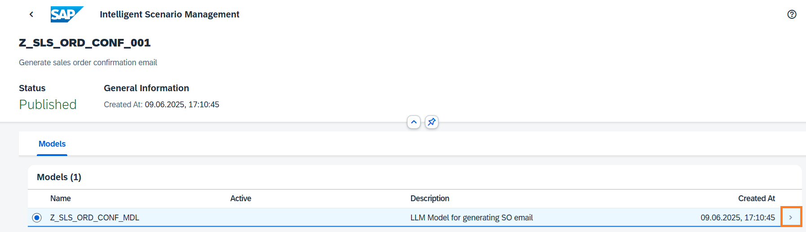
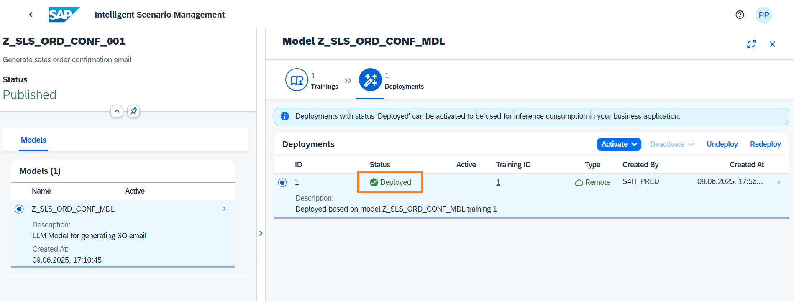
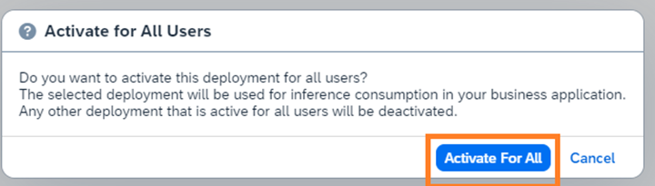

# Operate the Intelligent Scenario

Once the Intelligent Scenario is published, the Intelligent Scenario Management app helps you to deploy and activate the model for productive usage.
In this section, you will use the **Intelligent Scenario Management app** to perform operations on your Intelligent Scenario.

1. Open the Fiori Launchpad by clicking [here](https://18.214.3.29:44301/sap/bc/ui5_ui5/ui2/ushell/shells/abap/FioriLaunchpad.html?sap-client=100&sap-language=EN#Shell-home){:target="\_blank"}.
   Click on **Intelligent Scenario Management** section and choose the **Intelligent Scenario Management** app.
   
2. Search the **Gen AI** scenario created by you and navigate to the details page by clicking the **>** icon.
   
3. Navigate to details page by clicking the **>** icon
   
4. Select the default training and click the **Deploy** Button.
   
5. Click the **Deploy and Monitor** Button.
   
6. A new Deployment will be created in **Deployment Pending** status.
   
7. Monitor the status of Deployment and check the status changes to Deployed.
   **Note**: Deployments can take approximately 10 minutes to be Deployed.
   
8. Activate the deployment to run inference. Select the Deployment and click on **Activate** button and choose **For All** option.
   
9. In the dialog Activate for All Users, choose **Activate For All** button.
   

Well done, you just Used Intelligent Scenario Management app to deploy and activate the llm model.
