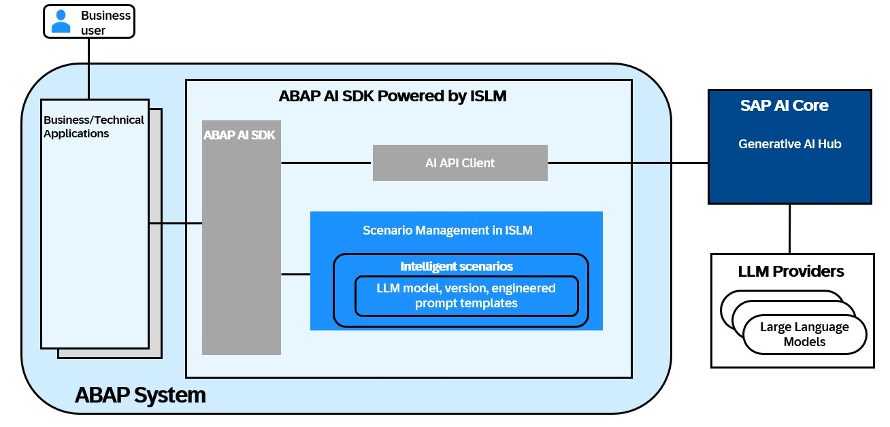

# Creating Custom Gen AI Use Cases in SAP S/4HANA

**Intelligent Scenario Lifecycle Management (ISLM)** is a key enabler for integrating AI into SAP S/4HANA. With its latest enhancements, ISLM now facilitates the adoption of generative AI (GenAI), providing customers and partners with a centralized framework to manage both SAP-delivered and custom AI use cases. This allows organizations to transform core business processes by integrating large language models (LLMs) seamlessly within their business applications.

Using the **ABAP AI SDK powered by Intelligent Scenario Lifecycle Management**, you can enhance your own custom ABAP-based applications with integrated generative AI features.
ISLM provides an auto enablement of generative AI-based scenarios and the connectivity management to access large language models. ISLM also provides the **Intelligent Scenario** and the **Intelligent Scenario Model**, transportable objects that contain all information to ship, instantiate, and run a solution based on generative AI functionality, including the information about the selected large language model and its version.
The ABAP AI SDK is a reuse library in an ABAP system that provides access to generative AI functionality via ISLM.

# Scope of the Workshop

Workshop aims to provide a deep dive into Intelligent Scenario Lifecycle Management (ISLM), focusing on its role as a catalyst for efficient AI (Artificial Intelligence) integration within SAP S/4HANA. The scope of this workshop includes:

# Introduction to ISLM

- Understanding the fundamentals of ISLM and its significance in the AI ecosystem.

# ISLM Integration

- Learning how ISLM standardizes the integration of intelligent scenarios within SAP S/4HANA.

# Embedding AI into applications

- Understanding how application developers leverage ISLM for creating, registering, publishing, and managing scenarios.

# Lifecycle Streamlining

- Discovering how ISLM simplifies and streamlines essential lifecycle operations, including training, deployment and activation.
  **Note: Data science and AI Content development is out of the scope of this session. In this workshop, we will explore how to develop, operate and integrate Generative AI capabilities in SAP S/4HANA using ISLM.**

# ISLM Key Capabilities

- **Centralized AI Management:** ISLM offers an end-to-end framework to manage both pre-delivered and custom AI scenarios in SAP S/4HANA. It enables organizations to integrate and operationalize AI use cases efficiently, ensuring seamless lifecycle management.
- **Integration with Large Language Models (LLMs):** ISLM allows customers and partners to:
  1. Develop custom generative AI based use cases tailored to their business needs.
  2. Integrate business applications with LLMs for enhanced automation and decision-making.
  3. Enable prompt templating capabilities for effective GenAI model usage.
- **Connectivity to GenAI Hub:** ISLM enables seamless connectivity to SAP’s Generative AI Hub.
- **ISLM and ABAP AI SDK Integration:** ABAP AI SDK and Intelligent Scenario Lifecycle Management serve as integration components between business applications and large language models. Using ABAP AI SDK powered by Intelligent Scenario Lifecycle Management (ISLM), you can easily embed generative AI capabilities into your custom ABAP based applications. ISLM and ABAP AI SDK offer a low-code approach within ABAP stack, enabling seamless integration of generative AI models into your business applications. With the combined experience of ISLM and the ABAP AI SDK, customers can develop and deploy generative AI-driven use cases directly within their SAP S/4HANA environment.
