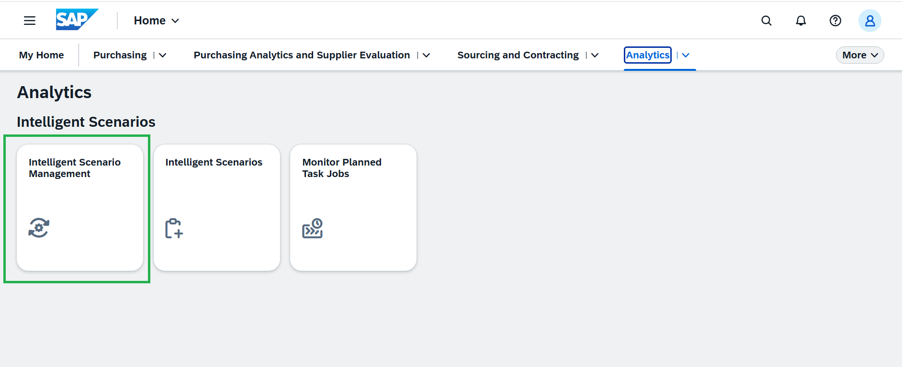
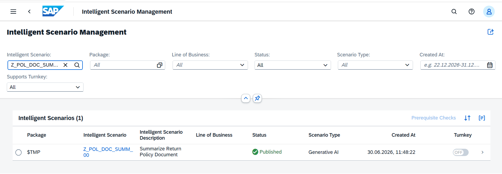
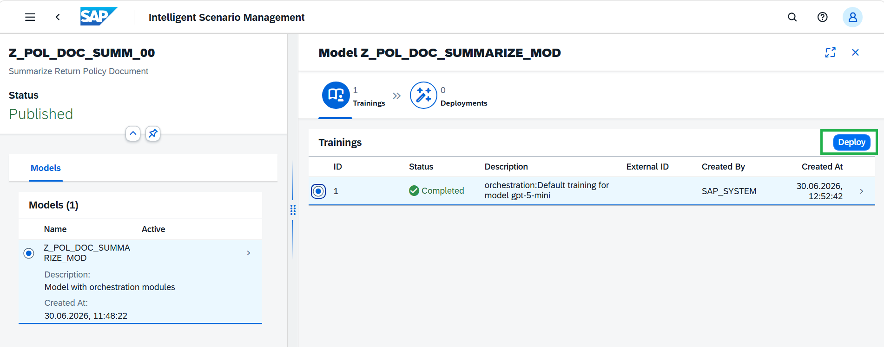
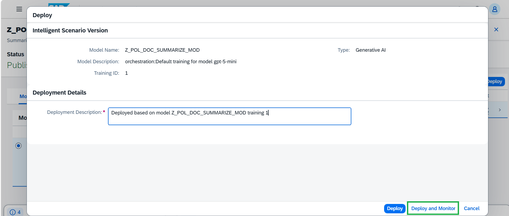
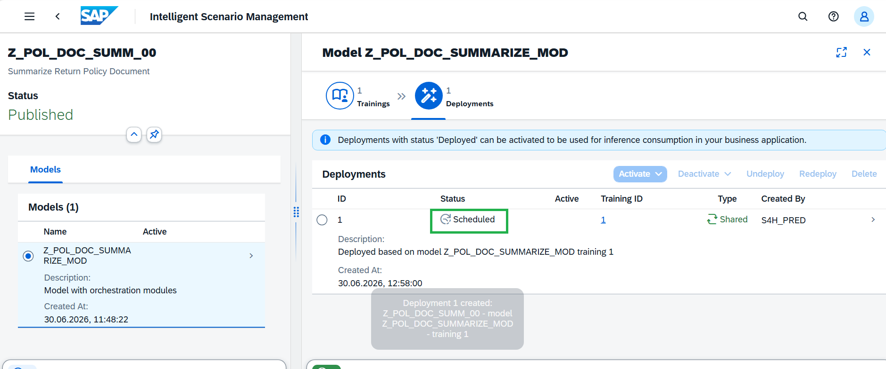
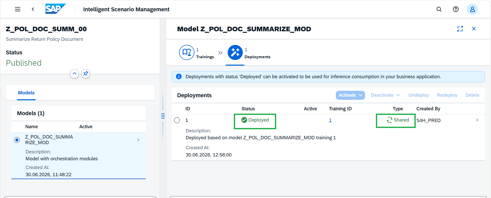
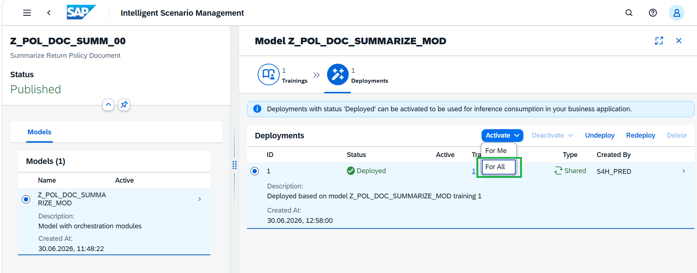
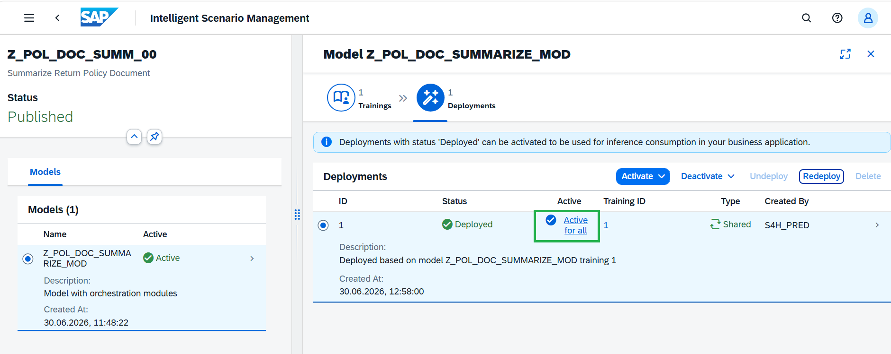

# Steps to Operate Intelligent Scenario 
1. Launch the SAP Fiori Launchpad by clicking [here](https://44.219.212.100:44301/sap/bc/ui5_ui5/ui2/ushell/shells/abap/FioriLaunchpad.html#Shell-home) and under **Analytics** tab, open the **Intelligent Scenario Management** app. 

2. Open the created scenario.

3. Sync completed successfully with the default training, as GenAI is a pre-trained model and the reuse connectivity is already maintained in the system.

4. Click **Deploy** and then **Deploy and Monitor**

5. Deployment is **Scheduled**.

6. Deployment is deployed immediately as it's **Shared deployment**.

7. Click **Activate** and do **Activate For All**.

**Intelligent Scenario** is active and ready for prompt execution.
