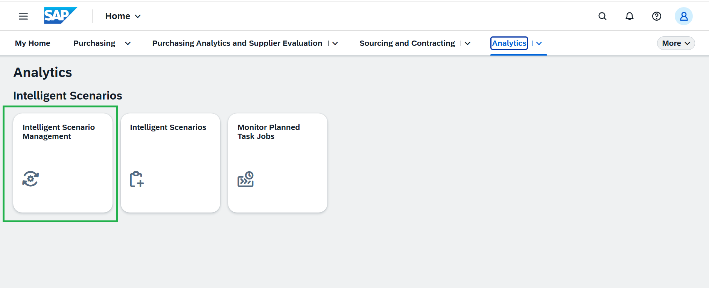
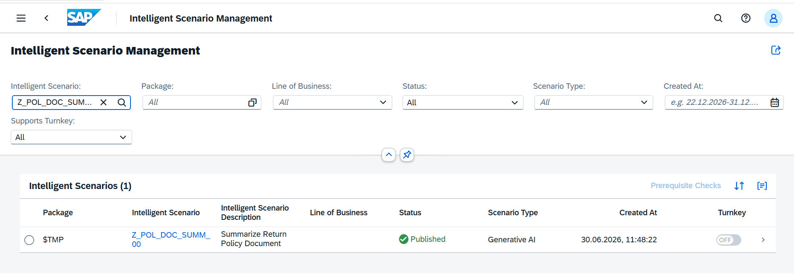
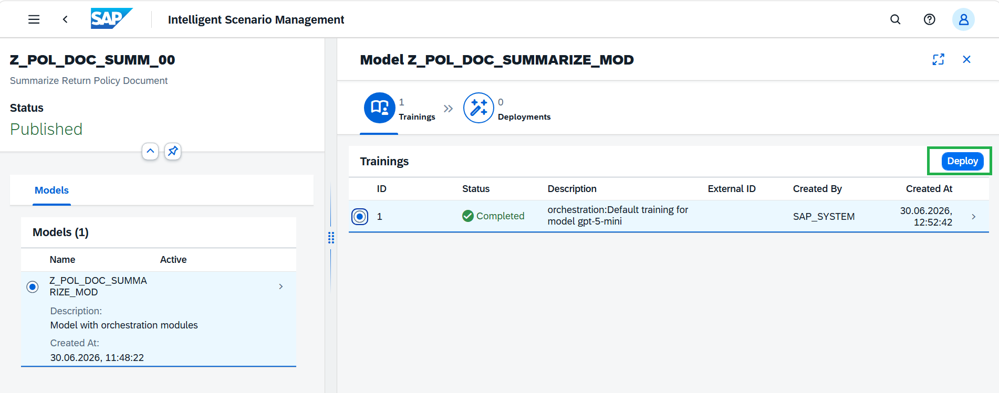
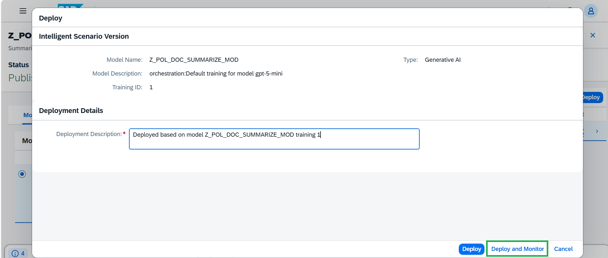
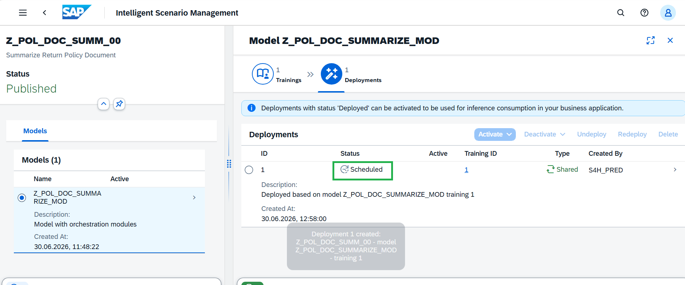
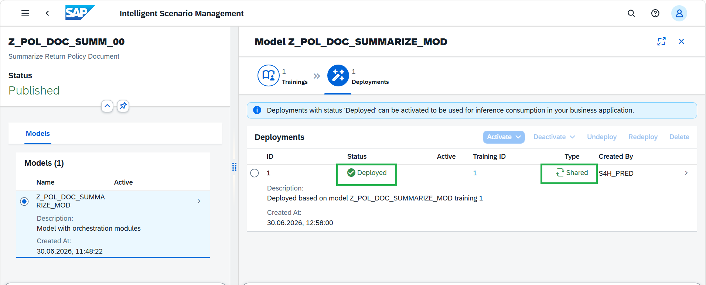
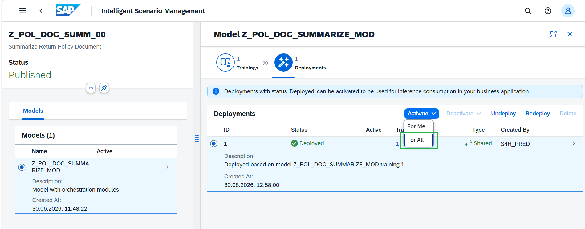
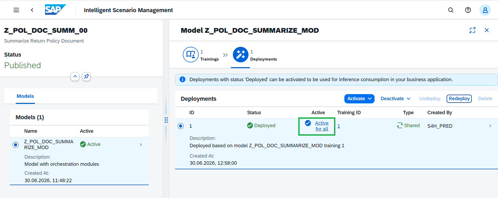

# Steps to Operate Intelligent Scenario 
1. Open the Fiori Launchpad and launch the **Intelligent Scenario Management** app under the **Analytics** tab. Please refer to the cheat sheet for guidance. 

2. Open the created scenario.

3. Sync completed successfully with the default training, as GenAI is a pre-trained model and the reuse connectivity is already maintained in the system.

4. **Deployment** makes the configured AI model or scenario available for use. Click **Deploy** and then **Deploy and Monitor**.  

5. Deployment is **Scheduled**.

6. Deployment is deployed immediately as it's **Shared deployment**.

7. **Activate** enables the deployed version so that it can be used for execution. After the required configuration is completed and deployed, the scenario can be activated so that applications can call it and receive responses. 
Click **Activate** and do **Activate For All**.  

**Intelligent Scenario** is active and ready for prompt execution.
