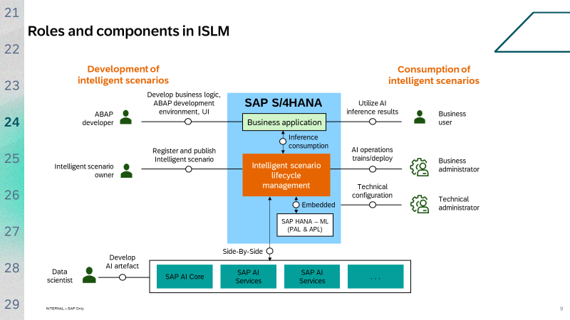

# Integrating Generative AI into SAP S/4HANA business applications with ISLM

### Scope of the Workshop
Workshop aims to provide a deep dive into ISLM, focusing on its role as a catalyst for efficient AI integration within SAP S/4HANA. The scope of this workshop includes:                                

#### Introduction to ISLM
- Understanding the fundamentals of ISLM and its significance in the AI ecosystem.

#### ISLM Integration
- Learning how ISLM standardizes the integration of intelligent scenarios within SAP S/4HANA.

#### Embedding AI into applications
- Understanding how application developers leverage ISLM for creating, registering, publishing, and managing scenarios.

#### Lifecycle Streamlining
- Discovering how ISLM simplifies and streamlines essential lifecycle operations, including training, deployment and activation.

**Note: Data science and AI Content development is out of the scope of this session. In this workshop, we will explore ML lifecycle management process.**
 
 

## Overview: Generate email for Sales order confirmation using GPT-4 large multimodal model 

### Exercise

In this exercise, we are using GPT-4 large multimodal model to generate an email for sales order confirmation. Sales executive will use the Intelligent Scenario Lifecycle Management (ISLM) framework to create and operate the ML use case.

ISLM is the single-entry point within SAP S/4HANA to efficiently integrate and operate machine learning scenarios. ISLM is being enhanced to act as application integration component between the applications and generative AI hub in SAP AI Core. ISLM is part of the standard SAP S/4HANA license, included in SAP BASIS Component, and available from SAP S/4HANA 2020 FPS0 and SAP S/4HANA Cloud 2011 onward.

This exercise includes the following steps:

1. [Prerequisites](Exercise/prerequisites.md)

2. [Create a new Intelligent Scenario](Exercise/create.md)

3. [Connect to GPT-4 model](Exercise/connect_with_tcode.md)

4. [Operate the Intelligent Scenario](Exercise/Operate.md)

5. [Consume Inference by executing prompt](Exercise/online_inference.md)

6. [Summary](Exercise/summary.md)

 

## Additional Links

1. [Cheat Sheet](Exercise/cheat_sheet.md)
2. [ISLM Community topic page](https://community.sap.com/topics/intelligent-scenario-lifecycle-management-s4hana)
3. [Developer Guideline for ML based on Generative AI](https://wiki.one.int.sap/wiki/display/LMCROSS/ML+Scenario+based+on+Generative+AI)

4. SAP Help Portal site links
    1. [SAP S/4HANA](https://help.sap.com/docs/SAP_S4HANA_ON-PREMISE/8308e6d301d54584a33cd04a9861bc52/436151b128614f0e84024015136043d3.html?version=2022.002)
    2. [SAP S/4HANA Cloud](https://help.sap.com/docs/SAP_S4HANA_CLOUD/a630d57fc5004c6383e7a81efee7a8bb/3fa32d7a1e21465f8d9696f6b8cb6ee9.html?version=2308.502)

5. Web session replays
    1. [SAP Community – Webinar](https://www.youtube.com/watch?v=gqQogqqfetA)
    2. [SAP TechEd – 2022 Session Replay](https://youtube.com/watch?v=xYEsKVoAuGM&si=EnSIkaIECMiOmarE)
    3. [SAP TechEd – 2022 Session Replay](https://youtube.com/watch?v=d8pDvt--RN8&si=EnSIkaIECMiOmarE)

6. SAP Community blogs and podcast series
    1. [ISLM Community topic page](https://community.sap.com/topics/intelligent-scenario-lifecycle-management-s4hana)

 
 

